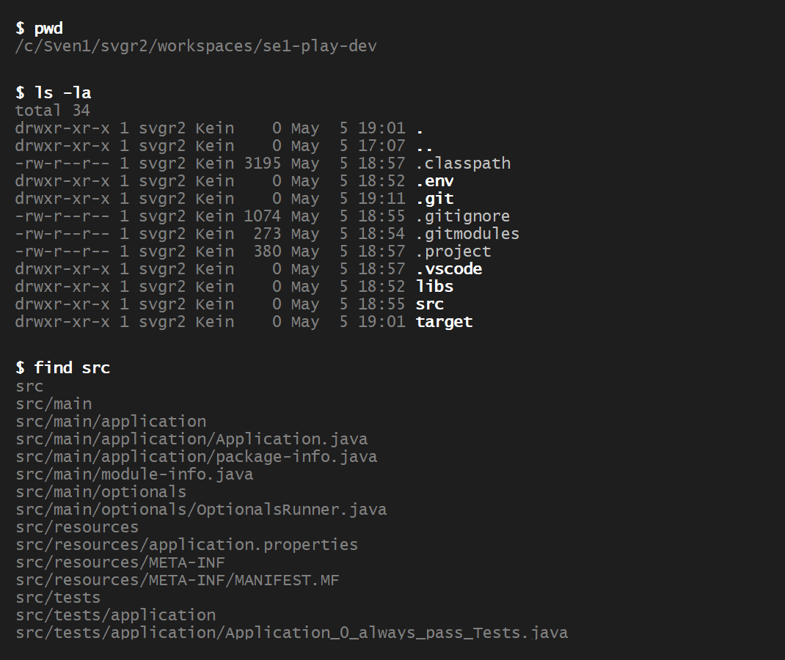
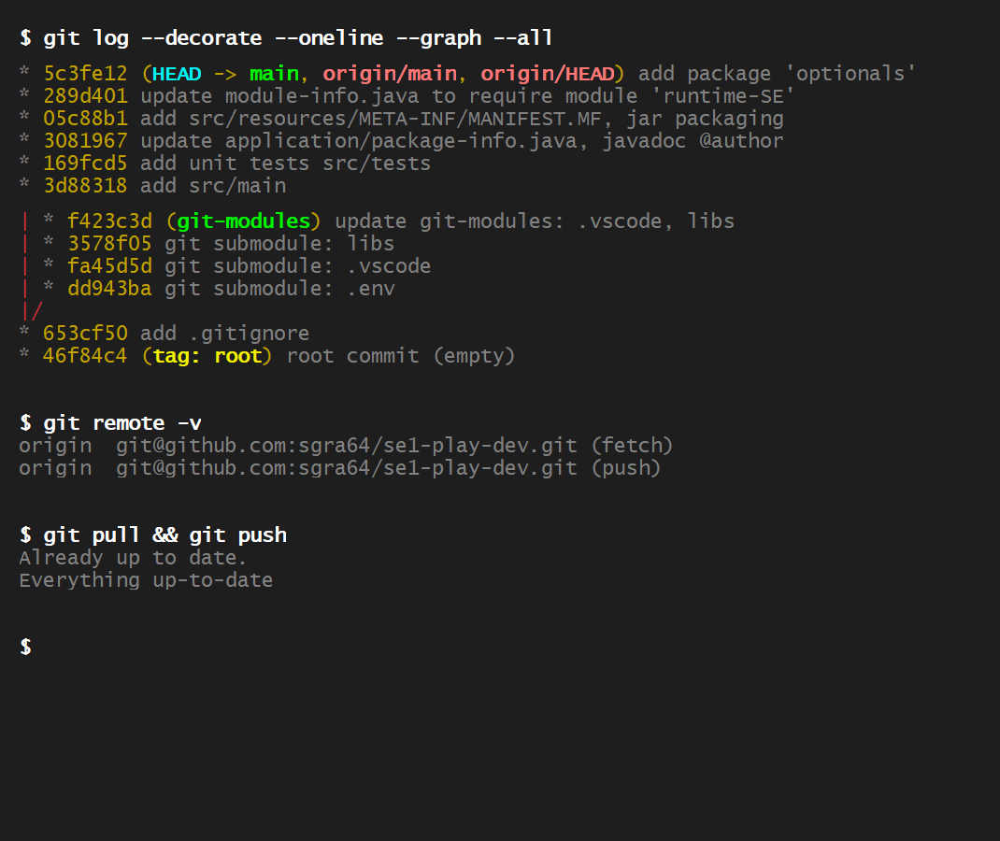

<!-- - - - - - - - - - - - - - - - - - - - - - - - - - - - - - - - - - - - -->
<!-- B2 (SE-1)
-->
# C1: *Ordering System* - *Calculator Component*

<!-- - - - - - - - - - - - - - - - - - - - - - - - - - - - - - - - - - - - -->

*Ordering System* is a demo application for processing customer orders such
as the order of
[*Customer*](src/main/datamodel/Customer.java):
*"Meyer, Eric"* with 4 ordered items: 4x Teller, 8x Becher, 1 Buch "OOP" and
4x Tassen.

- Each item refers to one
[*Article*](src/main/datamodel/Article.java) and

- a number *"unitsOrdered"* to
provide the number of articles ordered, see inner class *Item* in
(*Order.Item*)[src/main/datamodel/Order.java]

- Class *Article* also has the article *"gross-price"* (Brutto-Preis), which
includes [*VAT*](src/main/datamodel/VAT.java)
(Value-added Tax, Mehrwertsteuer) with different rates provided as codes:
`A:` *19%* for the regular rate, code `B:` *7%* for a reduced rate for food items
and code `C:` *7%* for print and media items. Code `A` applies by default, other
codes are marked, see code `(C)` for article *"Buch OOP"*.

```
+----------------------------------------+--------+--------+---------+---------+
| ORDER                                  |   MwSt |  Preis |    MwSt |   Preis |
+----------------------------------------+--------+--------+---------+---------+
| 8592356245                             |        |        |         |         |
| Meyer, Eric,                           |        |        |         |         |
| - 4 Teller, 4x 6.49                    |   4.14 |  25.96 |         |         |
| - 8 Becher, 8x 1.49                    |   1.90 |  11.92 |         |         |
| - 1 Buch "OOP", 1x 79.95  (C)          |   5.23 |  79.95 |         |         |
| - 4 Tasse, 4x 2.99                     |   1.91 |  11.96 |   13.18 |  129.79 |
+----------------------------------------+--------+--------+---------+---------+
```

Each *Article* belongs to a
[*Category*](src/main/datamodel/Category.java),
which also defines its *VAT code* and *rate*. File
[*categories.json*](src/resources/data/categories.json)
containes categories, including:

```json
[
    // Teller, Becher, Tasse: category 12 -> VAT code: 'A' -> VAT rate: 0.19 (19%)
    { "id": 12, "description": "Küche & Kochen", "vat_code": "A" },

    // Buch "OOP": category 53 -> VAT code 'C' -> VAT rate: 0.07 (7%)
    { "id": 53, "description": "Sachbuch", "vat_code": "C" }
]
```

---

The assignment has the following steps:

1. [Unterstand the Architecture of the *Ordering System*](#1-understand-the-architecture-of-the-ordering-system)

1. [Implement the *Calculator* Component](#2-implement-the-calculator-component)

1. [Evaluation (*Abnahme*)](#3-evaluation-abnahme)


<!-- - - - - - - - - - - - - - - - - - - - - - - - - - - - - - - - - - - - -->

&nbsp;

## 1. Unterstand the Architecture of the *Ordering System*

The Architecture of the *Ordering System* (and most sofware systems)
distinguishes between the:

- *Data Architecture* or the *Data Model* of the sofware system and the

- *System Architecture*, for which we use a
    *Component Architecture* where the system is made up of *"software components".

The project scaffold reflects the structure:

```
core system:
- src/main/application          - application drivers
- src/main/components           - public component interfaces
- src/main/components/impl      - non-public component implementation classes
- src/main/datamodel            - data model classes

- src/resources/data            - .json files with sample data
- src/resources/tables          - sample data formatted as tables 

unit-tests:
- src/tests/application         - unit-tests for package 'application'
- src/tests/components          - unit-tests for package 'components'

support packages:
- src/main/patterns             - demo of software pattern implementations
```

&nbsp;

The *Data Architecture* (*Data Model*) is shown in the following diagram:


See [*datamodel (Javadoc)*](https://sgra64.github.io/se1-play/ordering-system/datamodel/package-summary.html)
for documentation.
Paket [*datamodel*](src/main/datamodel) contains the *Data Model* classes:

```
src/main/datamodel:
- src/main/datamodel/Article.java
- src/main/datamodel/Customer.java
- src/main/datamodel/Order.java - includes class 'Item'
- src/main/datamodel/Category.java
- src/main/datamodel/VAT.java
```


&nbsp;

The *System Architecture* is shown as *Component Architecture* in the
following diagram:


See [*components (Javadoc)*](https://sgra64.github.io/se1-play/ordering-system/components/package-summary.html)
for documentation.
Paket
[*components*](src/main/components)
contains *public interfaces* of
components. Paket
[*components.impl*](src/main/components/impl)
holds the corresponding implementation classes:

```
src/main/components -- public component interfaces:
- src/main/components/Components.java
- src/main/components/Calculator.java
- src/main/components/DataFactory.java
- src/main/components/Formatters.java
- src/main/components/TableFormatter.java
- src/main/components/Repository.java

src/main/components/impl -- non-public component implementations:
- src/main/components/impl/ComponentsImpl.java
- src/main/components/impl/DataFactory.java
- src/main/components/impl/DataFactoryImpl.java
- src/main/components/impl/DataValidator.java
- src/main/components/impl/RepositoryFactory.java
- src/main/components/impl/RepositoryImpl.java
- (src/main/components/CalculatorImpl.java) -- create for the assignment
- src/main/components/impl/PriceFormatterImpl.java
- src/main/components/impl/TableFormatterFactoryImpl.java
```


<!-- - - - - - - - - - - - - - - - - - - - - - - - - - - - - - - - - - - - -->

&nbsp;

## 2. Implement the *Calculator* Component

Component *Calculator* performs various calculations for the ordering system.
Operations are defined in the public interface
[*Calculator.java*](src/main/components/Calculator.java):

```java
package components;

import datamodel.Article;
import datamodel.Order;
import datamodel.VAT;

/**
 * {@link Calculator} provides methods to perform calculations on objects of type
 * {@link Order} and {@link Order.Item}.
 */
public interface Calculator {

    /**
     * Calculate the total {@link Order} value as sum of values of all
     * ordered {@link Order.Item}s.
     * @param order subject of calculation.
     * @return total {@link Order} value.
     */
    long calculateOrderValue(Order order);

    /**
     * Calculate the {@link Order.Item} value as product of {@link Article}
     * price and the number of units ordered.
     * @param item subject of calculation.
     * @return {@link Order.Item} value.
     */
    long calculateOrderItemValue(Order.Item item);

    /**
     * Calculate the total VAT included in {@link Order.Item}s of an
     * {@link Order}.
     * @param order subject of calculation.
     * @return total VAT included in an {@link Order}.
     */
    long calculateIncludedVAT(Order order);

    /**
     * Calculate the VAT included in an ordered {@link Order.Item}.
     * @param item subject of calculation.
     * @return VAT included in an {@link Order.Item}.
     */
    long calculateIncludedVAT(Order.Item item);

    /**
     * Calculate the VAT included in a gross price.
     * @param grossPrice subject of calculation.
     * @param vatRate tax rate to apply, e.g. a value of 0.19 for a 19% rate
     * @return VAT included in a gross price.
     */
    long calculateIncludedVAT(long grossPrice, double vatRate);

    /**
     * Return the {@link VAT} of an {@link Article}.
     * @param article article for which {@link VAT} is returned.
     * @return {@link VAT} of an {@link Article}.
     */
    VAT vat_Code(Article article);

    /**
     * Return the current tax rate that apply to a {@link VAT} as 1/100-th,
     * e.g. for a tax rate of 19%, value 0.19 is returned.
     * @param vatCode vatCode for which the current tax rate is returned.
     * @return current tax rate.
     */
    double taxRate(VAT vatCode);
}
```

Steps:

1. Create a local branch: `ordering-system` off the project *"base"* commit.

1. Check-out content from the remote branch: `se1-repo/ordering-system`:

    1. fetch content.

    1. check-out: `src/main` and `src/resources` from the fetched remote branch.

1. Build and run the project. You will see the output of the last method of the
    interface *Calculator* (we implement methods bottom-up starting with the *"easiest"*
    method):

    - `double taxRate(VAT vatCode);`

    Output of the driver code for the method showing *0.00* as tax-rates for
    VAT-classes: `A`, `B` and `C`:
    ```
    Hello, 'Calculator'
    - taxRate(): rate A: 0.00, rate B: 0.00, rate C: 0.00
    ```

1. Open file:
    [*src/main/application/CalculatorDriver.java*](src/main/application/CalculatorDriver.java).
    The code shows the initialization of the calculator component variable, at which
    method: *taxRate()* is invoked producing the output above.

    ```java
        final Components components = Components.getInstance();
        final Calculator calculator = components.calculator();

        void run(RuntimeSE runtime, Components components, String[] args) {

            // 1.) develop method: double taxRate(VAT vatCode);
            double rateA = calculator.taxRate(VAT.A);
            double rateB = calculator.taxRate(VAT.B);
            double rateC = calculator.taxRate(VAT.C);
            // 
            System.out.println(String.format("- taxRate(): rate A: %.2f, rate B: %.2f, rate C: %.2f", rateA, rateB, rateC));
            ...
        }
    ```

1. Create an implementation class: `components.impl.CalculatorImpl` that implements
    the interface: `components.Calculator`. Fill-in default methods such that the code
    compiles.

1. Implement method: `double taxRate(VAT vatCode);` such that it returns correct
    VAT-rates for classes `A`: *0.19*, `B`: *0.07* and for `C`: *0.07* - meaning
    *19%* for class *A* and *7%* for classes *B* (food items) and *C* (print and
    media items).

1. Rebuild and re-run the program. The change is not yet effective, the program still
    outputs: *0.00* values.

1. Figure out what the problem might be. *Hint:* component instances (objects of
    classes implementing component interfaces) are created in:
    [*src/main/components/impl/ComponentsImpl.java*](src/main/components/impl/ComponentsImpl.java).

    - Make changes that the new implementation class *components.impl.CalculatorImpl*
    is instantiated.

    - Re-build and run the program.

    - Output show now show the correct numbers:
    ```
    Hello, 'Calculator'
    - taxRate(): rate A: 0.19, rate B: 0.07, rate C: 0.07
    ```

1. When this is working, check-out unit-tests from branch *se1-repo/ordering-system*:

    - [*src/tests/components/Calculator_010_setup_Tests.java*](src/tests/components/Calculator_010_setup_Tests.java) and

    - [*src/tests/components/Calculator_100_taxRate_Tests.java*](src/tests/components/Calculator_100_taxRate_Tests.java).

    Run tests:

    ```sh
    mk run-tests -c components.Calculator_100_taxRate_Tests
    ```
    ```
    ╷
    ├─ JUnit Platform Suite ✔
    ├─ JUnit Jupiter ✔
    │  └─ Calculator_100_taxRate_Tests ✔
    │     ├─ test_110_taxRate_exception_tests() ✔
    │     └─ test_100_taxRate() ✔
    └─ JUnit Vintage ✔

    Test run finished after 399 ms
    [         2 tests successful      ]
    [         0 tests failed          ]
    ```

1. Commit changes with message: `1.) method 'taxRate(VAT vatCode)' complete`.


&nbsp;

Repeat the process for the other methods in
[*src/main/components/Components.java*](src/main/components/Components.java) with
corresponding tests one-after-another:

- 2.) method: `VAT vat_Code(Article article);` returns the
        [*VAT*](src/main/datamodel/VAT.java) - code that applies to an
        [*Article*](src/main/datamodel/Article.java).

    - Uncomment section: *"2.) ... "* in
    [*src/main/application/CalculatorDriver.java*](src/main/application/CalculatorDriver.java)
    that exercises the method:

        ```java
        // 2.) develop method: VAT vat_Code(Article article);
        VAT vat1 = calculator.vat_Code(teller);
        VAT vat2 = calculator.vat_Code(becher);
        VAT vat3 = calculator.vat_Code(buch_oop);
        VAT vat4 = calculator.vat_Code(tasse);
        VAT vat5 = calculator.vat_Code(waescheleine);
        VAT vat6 = calculator.vat_Code(roggenbrot);
        VAT vat7 = calculator.vat_Code(book);
        // 
        System.out.println(String.format(
            "- vat_Code(): teller: %s, becher: %s, buch_oop: %s, tasse: %s, " +
            "waescheleine: %s, roggenbrot: %s, book: %s",
            vat1, vat2, vat3, vat4, vat5, vat6, vat7));
        ```

    - Implement the method and run the code:

        ```
        Hello, 'Calculator'
        - taxRate(): rate A: 0.19, rate B: 0.07, rate C: 0.07
        - vat_Code(): teller: A, becher: A, buch_oop: C, tasse: A, waescheleine: A, roggenbrot: B, book: C
        ```

    - Checkout and run test: [`src/tests/components/Calculator_200_vat_Code_Tests.java`](src/tests/components/Calculator_200_vat_Code_Tests.java).

    - Commit changes with message: `2.) method 'vat_Code(Article article)' complete`.

&nbsp;

- 3.) method: `long calculateIncludedVAT(long grossPrice, double vatRate);` -- uncomment
    section ``

    with test: [`src/tests/components/Calculator_300_calculateIncludedVAT_Tests.java`](src/tests/components/Calculator_300_calculateIncludedVAT_Tests.java),

    commit with message: `3.) method 'calculateIncludedVAT(long grossPrice, double vatRate)' complete`.


&nbsp;

- 4.) method: `long calculateIncludedVAT(Order.Item item);`

    with test: [`src/tests/components/Calculator_400_calculateIncludedVAT_Tests.java`](src/tests/components/Calculator_400_calculateIncludedVAT_Tests.java),

    commit with message: `4.) method 'calculateIncludedVAT(Order.Item item)' complete`.


&nbsp;

- 5.) method: `long calculateIncludedVAT(Order order);`

    with test: [`src/tests/components/Calculator_500_calculateIncludedVAT_Tests.java`](src/tests/components/Calculator_500_calculateIncludedVAT_Tests.java),

    commit with message: `5.) method 'calculateIncludedVAT(Order order)' complete`.

&nbsp;

- 6.) method: `long calculateOrderItemValue(Order.Item item);`

    with test: [`src/tests/components/Calculator_600_calculateOrderItemValue_Tests.java`](src/tests/components/Calculator_600_calculateOrderItemValue_Tests.java),

    commit with message: `6.) method 'calculateOrderItemValue(Order.Item item)' complete`.

&nbsp;

- 7.) method: `long calculateOrderValue(Order order);`

    with test: [`src/tests/components/Calculator_700_calculateOrderValue_Tests.java`](src/tests/components/Calculator_700_calculateOrderValue_Tests.java),

    commit with message: `7.) method 'calculateOrderValue(Order order)' complete`.


<!-- - - - - - - - - - - - - - - - - - - - - - - - - - - - - - - - - - - - -->

&nbsp;

## 3. Evaluation (*Abnahme*)

Show the commit-log with the commits for each implemented method:

```sh
git log --oneline
```
```
6706272 (HEAD -> ordering-system) 7.) method 'calculateOrderValue(Order order)' complete
aecb494 6.) method 'calculateOrderItemValue(Order.Item item)' complete
ff87e68 5.) method 'calculateIncludedVAT(Order order)' complete
4faec78 4.) method 'calculateIncludedVAT(Order.Item item)' complete
74d280c 3.) method 'calculateIncludedVAT(long grossPrice, double vatRate)' complete
c7b7dfd 2.) method 'vat_Code(Article article)' complete
1adba08 1.) method 'taxRate(VAT vatCode)' complete
// 
0889bca (tag: base, main) ...   <-- base commit for branch 'ordering-system'
...
```

[*CalculatorDriver.java*](src/main/application/CalculatorDriver.java)
outputs correct values for all methods:

```
Hello, 'Calculator'

- taxRate(): rate A: 0.19, rate B: 0.07, rate C: 0.07

- vat_Code(): teller: A, becher: A, buch_oop: C, tasse: A, waescheleine: A, roggenbrot: B, book: C

- calculateIncludedVAT(): 4x Teller: 4.14€, 8x Becher: 1.90€, 1 Buch "OOP": 5.23€, 4x Tasse: 1.91€

- calculateIncludedVAT(): 19% included VAT in 100€: 15.97€, 19% included VAT in 119€: 19.00€

- calculateIncludedVAT(): in order '8592356245' item-1:  4.14€, item-2: 1.90€, item-3: 5.23€, item-4:  1.91€

- calculateIncludedVAT(): in order '6135735635' item-1: 12.43€, item-2: 3.26€, item-3: 5.23€

- calculateIncludedVAT(): order '5234': 3.19€, order '6173':  3.71€, order '8592': 13.18€, order '6135': 20.92€

- calculateIncludedVAT(): order '3563': 3.02€, order '7372': 27.43€, order '4450':  5.33€

- calculateOrderItemValue(): in order '6135735635' item-1: 25.96€, item-2: 11.92€, item-3: 79.95€

- calculateOrderItemValue(): in order '6135735635' item-1: 77.88€, item-2: 49.90€, item-3: 79.95€

- calculateOrderValue(): order '5234': 19.99€, order '6173':   56.85€, order '8592':  129.79€, order '6135': 207.73€

- calculateOrderValue(): order '3563': 18.96€, order '7372':  175.95€, order '4450':   33.43€
```


&nbsp;

All tests are passing:

```
╷
├─ JUnit Platform Suite ✔
├─ JUnit Jupiter ✔
│  ├─ Calculator_300_calculateIncludedVAT_Tests ✔
│  │  ├─ test_310_calculateIncludedVAT_corner_tests() ✔
│  │  ├─ test_320_calculateIncludedVAT_corner_values_tests() ✔
│  │  ├─ test_300_calculateIncludedVAT_regular_tests() ✔
│  │  ├─ test_311_calculateIncludedVAT_corner_tests() ✔
│  │  ├─ test_301_calculateIncludedVAT_regular_tests() ✔
│  │  ├─ test_321_calculateIncludedVAT_corner_neg_values_tests() ✔
│  │  └─ test_312_calculateIncludedVAT_corner_tests() ✔
│  ├─ Application_0_always_pass_Tests ✔
│  │  ├─ test_001_always_pass() ✔
│  │  └─ test_002_always_pass() ✔
│  ├─ Calculator_200_vat_Code_Tests ✔
│  │  ├─ test_210_vat_Code_exception_tests() ✔
│  │  ├─ test_201_vat_Code_extra_tests() ✔
│  │  └─ test_200_vat_Code_tests() ✔
│  ├─ Calculator_010_setup_Tests ✔
│  │  └─ test_010_RepositorySetup() ✔
│  ├─ Calculator_700_calculateOrderValue_Tests ✔
│  │  ├─ test_502_calculateOrderValue_regular_order_8592_tests() ✔
│  │  ├─ test_710_calculateOrderValue_exception_tests() ✔
│  │  ├─ test_505_calculateOrderValue_regular_order_7372_tests() ✔
│  │  ├─ test_501_calculateOrderValue_regular_order_6173_tests() ✔
│  │  ├─ test_506_calculateOrderValue_regular_order_4450_tests() ✔
│  │  ├─ test_504_calculateOrderValue_regular_order_3563_tests() ✔
│  │  ├─ test_503_calculateOrderValue_regular_order_6135_tests() ✔
│  │  └─ test_500_calculateOrderValue_regular_order_5234_tests() ✔
│  ├─ Calculator_500_calculateIncludedVAT_Tests ✔
│  │  ├─ test_502_calculateIncludedVAT_regular_order_8592_tests() ✔
│  │  ├─ test_504_calculateIncludedVAT_regular_order_3563_tests() ✔
│  │  ├─ test_506_calculateIncludedVAT_regular_order_4450_tests() ✔
│  │  ├─ test_503_calculateIncludedVAT_regular_order_6135_tests() ✔
│  │  ├─ test_505_calculateIncludedVAT_regular_order_7372_tests() ✔
│  │  ├─ test_500_calculateIncludedVAT_regular_order_5234_tests() ✔
│  │  ├─ test_510_calculateIncludedVAT_exception_tests() ✔
│  │  └─ test_501_calculateIncludedVAT_regular_order_6173_tests() ✔
│  ├─ Calculator_400_calculateIncludedVAT_Tests ✔
│  │  ├─ test_400_calculateIncludedVAT_regular_order_8592_tests() ✔
│  │  ├─ test_410_calculateIncludedVAT_exception_tests() ✔
│  │  └─ test_401_calculateIncludedVAT_regular_order_6135_tests() ✔
│  ├─ Calculator_600_calculateOrderItemValue_Tests ✔
│  │  ├─ test_601_calculateOrderItemValue_regular_order6135_tests() ✔
│  │  ├─ test_600_calculateOrderItemValue_regular_order8592_tests() ✔
│  │  └─ test_610_calculateOrderItemValue_exception_tests() ✔
│  └─ Calculator_100_taxRate_Tests ✔
│     ├─ test_110_taxRate_exception_tests() ✔
│     └─ test_100_taxRate() ✔
└─ JUnit Vintage ✔

Test run finished after 810 ms
[        37 tests successful      ]
[         0 tests failed          ]
```


&nbsp;

Run the final segment in
[*CalculatorDriver.java*](src/main/application/CalculatorDriver.java):

```java
/**
 * Create sample {@link Order} to verify {@link Calculator} methods.
 * <pre>
 * +------------------------------------+--------+--------+---------+---------+
 * | ORDER                              |   MwSt |  Preis |    MwSt |   Preis |
 * +------------------------------------+--------+--------+---------+---------+
 * | 8592356245                         |        |        |         |         |
 * | Meyer, Eric,                       |        |        |         |         |
 * | - 4 Teller, 4x 6.49                |   4.14 |  25.96 |         |         |
 * | - 8 Becher, 8x 1.49                |   1.90 |  11.92 |         |         |
 * | - 1 Buch "OOP", 1x 79.95 (C)       |   5.23 |  79.95 |         |         |
 * | - 4 Tasse, 4x 2.99                 |   1.91 |  11.96 |   13.18 |  129.79 |
 * +------------------------------------+--------+--------+---------+---------+
 * </pre>
 * @param runtime
 * @param components
 * @param args
 */
void run(RuntimeSE runtime, Components components, String[] args) {

    // ...

    /**
     * When done, print the whole 'Order'-table:
     */
    System.out.println();
    printOrderTable();
}
```

Output shows the *"Order"*-table with correct values:

```
+--------------------------------------+-+--------+--------+---------+---------+
| ORDER                                |T|   MwSt |  Preis |    MwSt |   Preis |
+--------------------------------------+-+--------+--------+---------+---------+
| 5234968294                             |        |        |         |         |
| Meyer, Eric                            |        |        |         |         |
| - 1 Kanne, 1x 19.99                    |   3.19 |  19.99 |    3.19 |   19.99 |
+--------------------------------------+-+--------+--------+---------+---------+
| 6173043537                             |        |        |         |         |
| Neumann, Lena                          |        |        |         |         |
| - 1 Buch "Java", 1x 49.90             C|   3.26 |  49.90 |         |         |
| - 1 Fahrradkarte Berlin, 1x 6.95      C|   0.45 |   6.95 |    3.71 |   56.85 |
+--------------------------------------+-+--------+--------+---------+---------+
| 8592356245                             |        |        |         |         |
| Meyer, Eric                            |        |        |         |         |
| - 4 Teller, 4x 6.49                    |   4.14 |  25.96 |         |         |
| - 8 Becher, 8x 1.49                    |   1.90 |  11.92 |         |         |
| - 1 Buch "OOP", 1x 79.95              C|   5.23 |  79.95 |         |         |
| - 4 Tasse, 4x 2.99                     |   1.91 |  11.96 |   13.18 |  129.79 |
+--------------------------------------+-+--------+--------+---------+---------+
| 6135735635                             |        |        |         |         |
| Blumenfeld, Nadine-Ulla                |        |        |         |         |
| - 12 Teller, 12x 6.49                  |  12.43 |  77.88 |         |         |
| - 1 Buch "Java", 1x 49.90             C|   3.26 |  49.90 |         |         |
| - 1 Buch "OOP", 1x 79.95              C|   5.23 |  79.95 |   20.92 |  207.73 |
+--------------------------------------+-+--------+--------+---------+---------+
| 3563561357                             |        |        |         |         |
| Bayer, Anne                            |        |        |         |         |
| - 2 Teller, 2x 6.49                    |   2.07 |  12.98 |         |         |
| - 2 Tasse, 2x 2.99                     |   0.95 |   5.98 |    3.02 |   18.96 |
+--------------------------------------+-+--------+--------+---------+---------+
| 7372561535                             |        |        |         |         |
| Meyer, Eric                            |        |        |         |         |
| - 1 Fahrradhelm, 1x 169.00             |  26.98 | 169.00 |         |         |
| - 1 Fahrradkarte Berlin, 1x 6.95      C|   0.45 |   6.95 |   27.43 |  175.95 |
+--------------------------------------+-+--------+--------+---------+---------+
| 4450305661                             |        |        |         |         |
| Meyer, Eric                            |        |        |         |         |
| - 3 Tasse, 3x 2.99                     |   1.43 |   8.97 |         |         |
| - 3 Becher, 3x 1.49                    |   0.71 |   4.47 |         |         |
| - 1 Kanne, 1x 19.99                    |   3.19 |  19.99 |    5.33 |   33.43 |
+--------------------------------------+-+--------+--------+---------+---------+
                                                           |   76.78 |  642.70 |
                                                           +=========+=========+
```

<!-- 
<table>
  <td valign="top">
    
  </td>
  <td valign="top">
    
  </td>
</table>
-->
