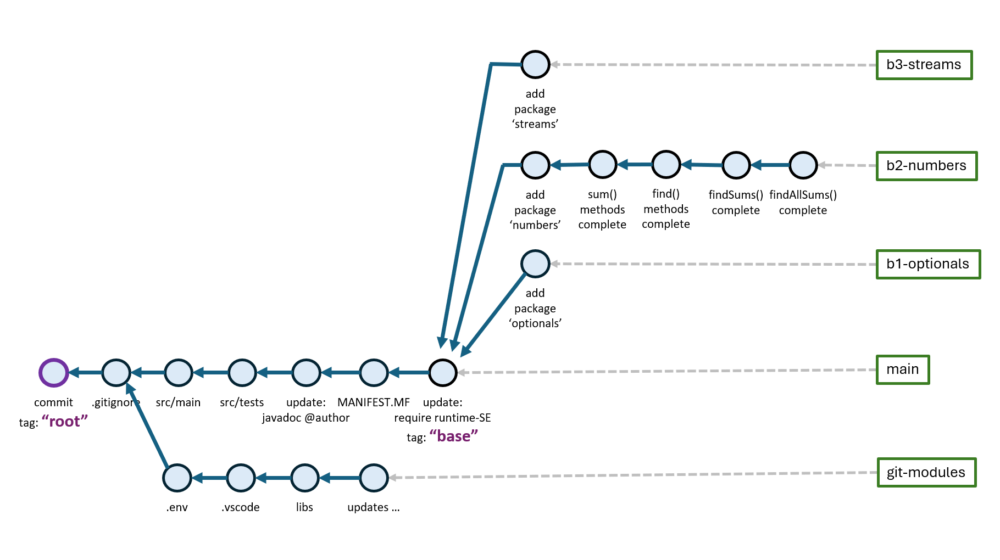
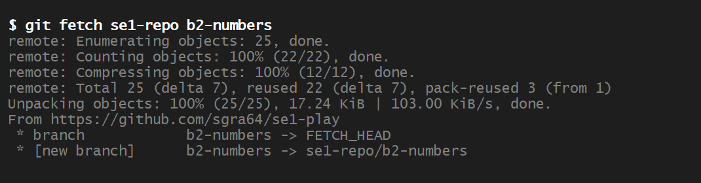
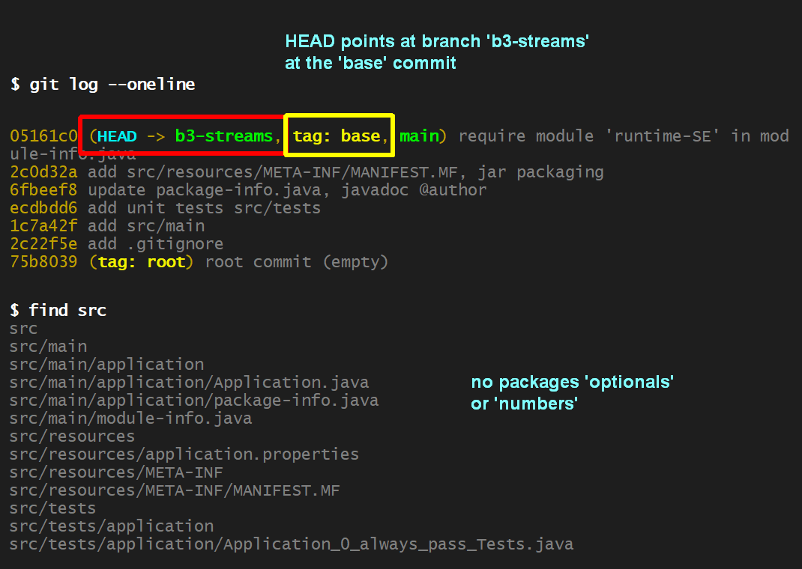
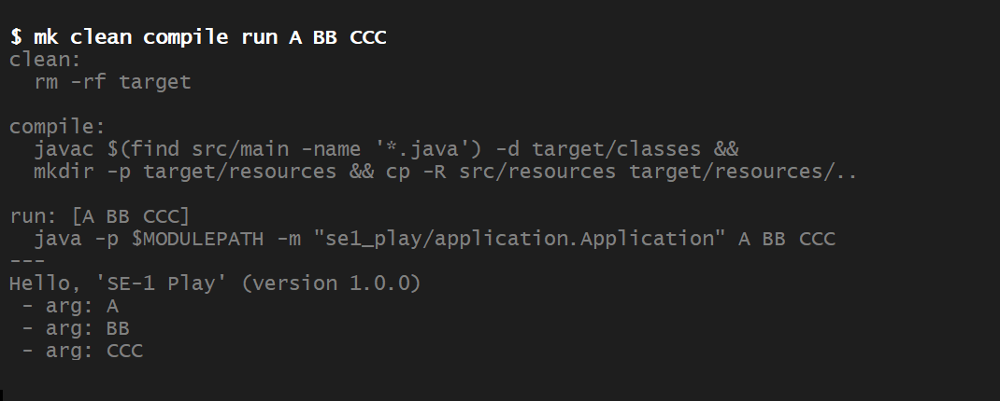
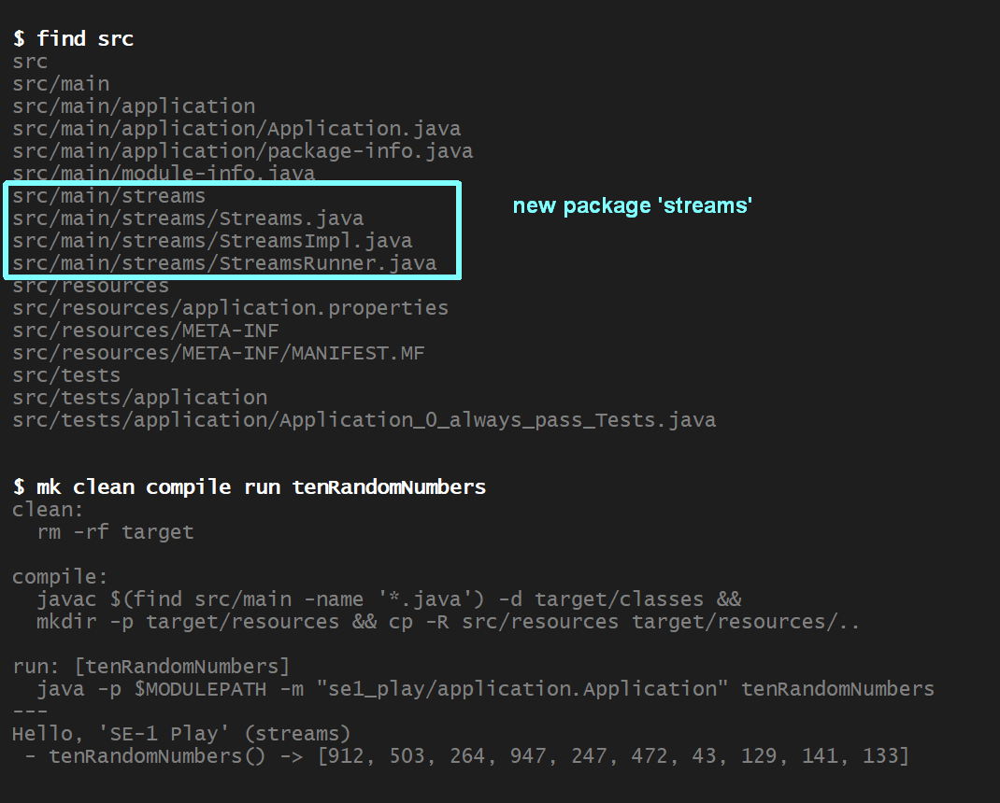
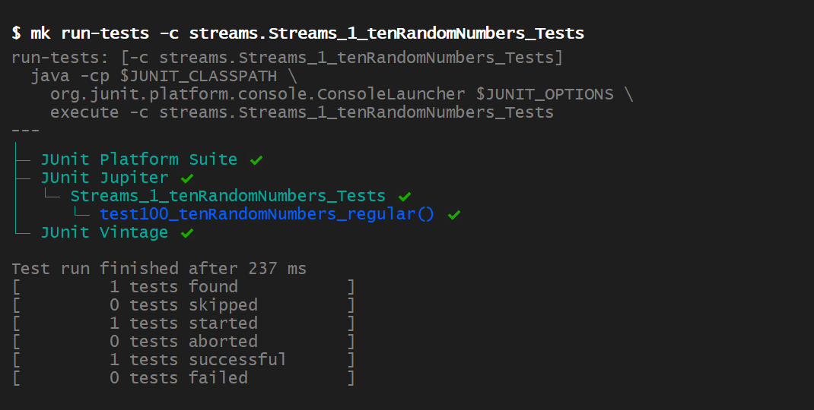
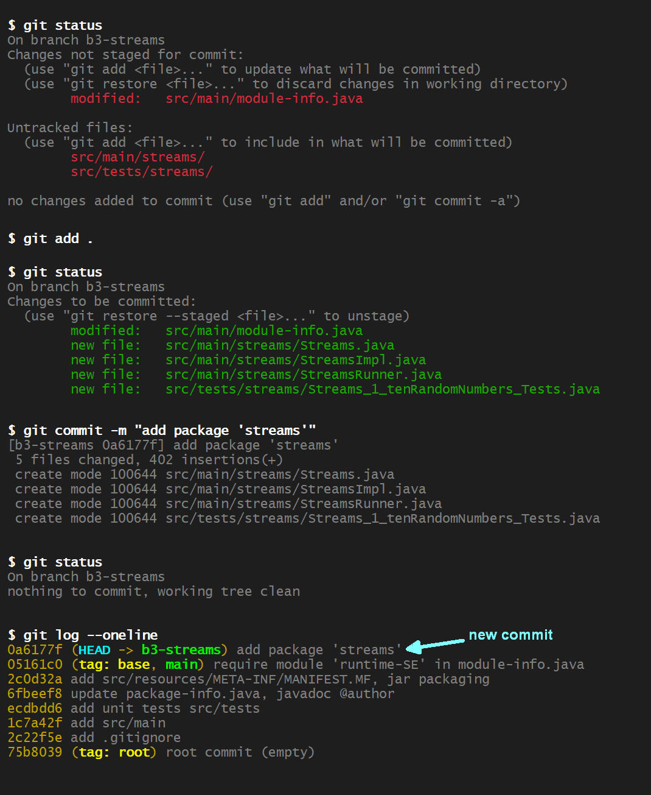
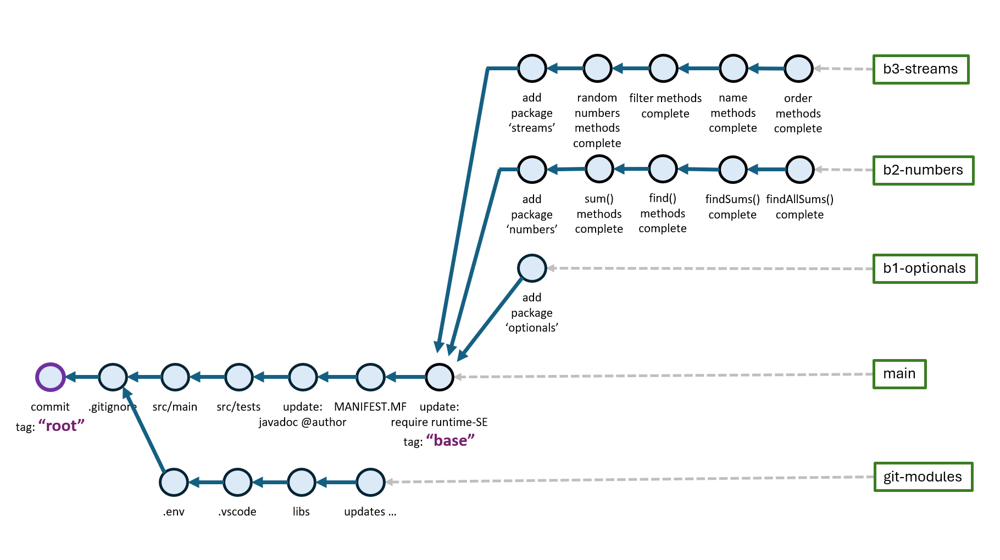
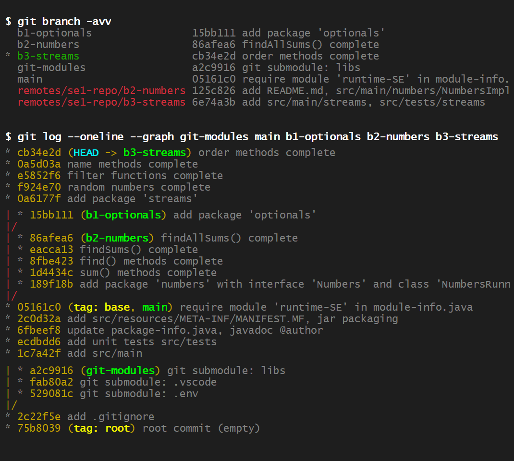

<!-- - - - - - - - - - - - - - - - - - - - - - - - - - - - - - - - - - - - -->
<!-- B2 (SE-1)
-->
# B3: *streams*

<!-- - - - - - - - - - - - - - - - - - - - - - - - - - - - - - - - - - - - -->

The assignment introduces
[*Java Streams*](https://winterbe.com/posts/2014/07/31/java8-stream-tutorial-examples/)
(see [*Streams.java*](https://docs.oracle.com/en/java/javase/23/docs/api/java.base/java/util/stream/Stream.html)
Javadoc) using a new branch: `"b3-streams"` branched off the *main* branch at the
*"base"* commit:


<!-- 

[*se1-play*](../../tree/main) project.
-->


&nbsp;

---

Assignment *"b3-streams"* will perform the following steps:

1. [Java *Streams API* Introduction](#1-java-streams-api-introduction)

1. [Setup new Branch: *"b3-streams"*](#2-setup-new-branch-b3-streams)

1. [Complete *randomNumbers* Methods](#3-complete-randomnumbers-methods)

1. [*Filter* Function Methods](#4-filter-function-methods)

1. [*Name* Methods](#5-name-methods)

1. [*Order* Methods](#6-order-methods)

7. [*Release Preparation* and *Release*](#7-release-preparation-and-release)

1. [Final Evaluation (Abnahme)](#8-final-evaluation-abnahme)


<!-- - - - - - - - - - - - - - - - - - - - - - - - - - - - - - - - - - - - -->

&nbsp;

## 1. Java *Streams API* Introduction

The
[*Java Streams API*](https://docs.oracle.com/en/java/javase/23/docs/api/java.base/java/util/stream/Stream.html)
has been introduced with Java version 8 (2014) to support *data-streams* and *stream-based programming*.

A `Stream` consists of three parts:

1. A streams starts with a `Source` from where data originates or is emitted,

    - e.g. a *Collection* (List, Array, ...), a *Range* or a *Supplier*.

1. A sequence of *chained*
    [*functions*](https://docs.oracle.com/en/java/javase/25/docs/api/java.base/java/util/stream/Stream.html)
    that is applied to each data object passing through the stream,

    - examples: *map()*, *filter()*, *findAny()*, *sorted()*, etc.

1. A `Sink` that *pulls data* from the stream producing a *result* by applying a *terminal*
    [*function*](https://docs.oracle.com/en/java/javase/25/docs/api/java.base/java/util/stream/Stream.html)

    - such as *reduce()*, *sum()*, *collect()*, *forEach()*.


<!-- - - - - - - - - - - - - - - - - - - - - - - - - - - - - - - - - - - - -->

&nbsp;

## 2. Setup new Branch: *"b3-streams"*

Create a new branch off the *"base"* commit on the *main* branch. Verify no
content of other branches *b1-optionals* or *b2-numbers* is present on the
new branch:

```sh
# verify new branch 'b3-streams'
git log --oneline

# make sure 'src' does not contain packages 'optionals' or 'numbers'
find src

# after clean-project-build runs the program copying command line arguments
mk clean compile run A BB CCC
```





<!-- &nbsp; -->

The *Java Streams* assignment is defined by the interface
[*Streams.java*](src/main/streams/Streams.java):

```java
package streams;

import java.util.*;
import java.util.function.Function;
import java.util.stream.Stream;

/**
 * Public interface for the <i>"b3-streams"</i> assignment.
 * 
 * @version <code style=color:green>{@value application.package_info#Version}</code>
 * @author <code style=color:blue>{@value application.package_info#Author}</code>
 */
public interface Streams {

    /**
     * Aufgabe 1: Return 10 random integer numbers in the range [0..999].
     * @return a {@code Stream<Integer>} from which 10 random numbers can be drawn
     */
    Stream<Integer> tenRandomNumbers();

    /**
     * Aufgabe 2: Return 10 even random integer numbers in the range [0..999].
     * @return a {@code Stream<Integer>} from which 10 even random numbers can be drawn
     */
    Stream<Integer> tenEvenRandomNumbers();

    /**
     * Aufgabe 3: Return 10 even sorted random integer numbers in the range [0..999].
     * @return a {@code Stream<Integer>} from which 10 sorted even random numbers can be drawn
     */
    Stream<Integer> tenSortedEvenRandomNumbers();


    /**
     * lambda expression returning true if n is an even number.
     */
    static final Function<Integer, Boolean> evenFilter = n -> n > 0 && n % 2 == 0;

    /**
     * FILL-IN a lambda expression returning true if n is divisable by three.
     */
    static final Function<Integer, Boolean> div3Filter = n -> true;

    /**
     * FILL-IN a lambda expression returning true if n has three-digits and is a prime number.
     */
    static final Function<Integer, Boolean> primeFilter = n -> true;

    /**
     * Aufgabe 4: Apply {@code filterFunction} to a stream of random integer numbers
     * in the range of [0..999] that produces only numbers passing the filter.
     * @param filterFunction lambda expression that filters numbers
     * @param limit maximum amount of numbers produced
     * @return numbers matching the filterFunction
     */
    List<Integer> filteredNumbers(Function<Integer, Boolean> filterFunction, int limit);


    /*
     * Names used in methods below.
     */
    static final List<String> names = List.of(
        "Hendricks", "Raymond", "Pena", "Gonzalez", "Nielsen", "Hamilton",
        "Graham", "Gill", "Vance", "Howe", "Ray", "Talley", "Brock", "Hall",
        "Gomez", "Bernard", "Witt", "Joyner", "Rutledge", "Petty", "Strong",
        "Soto", "Duncan", "Lott", "Case", "Richardson", "Crane", "Cleveland",
        "Casey", "Buckner", "Hardin", "Marquez", "Navarro"
    );

    /**
     * Aufgabe 5: Return a sub-list of names filtered by a regular expression
     * (see: {@link java.util.regex.Pattern}). The order of names remains unchanged.
     * @param names input names
     * @param regex regular expression according to {@link java.util.regex.Pattern}
     * @return list of names matching the regular expression
     */
    List<String> filteredNames(List<String> names, String regex);

    /**
     * Aufgabe 6: Return names alphabetically sorted up to a given limit.
     * @param names input names
     * @param limit maximum number of names returned
     * @return alphabetically sorted list of names up to the given limit
     */
    List<String> sortedNames(List<String> names, int limit);

    /**
     * Aufgabe 7: Return names sorted by name length as first criteria and
     * within same-length names alphabetically sorted as second criteria.
     * @param names input names
     * @return names sorted by name length
     */
    List<String> sortedNamesByLength(List<String> names);


    /**
     * Aufgabe 8: Class {@link Order} defines an order (Bestellung) of
     * n (units) of an article at a price per unit (in Cent).
     */
    class Order {
        private final String article;
        private final long units;
        private final long unitPrice;
        //
        public Order(String description, long units, long unitPrice) {
            this.article = description;
            this.units = units;
            this.unitPrice = unitPrice;
        }

        // getter methods
        public String article() { return article; }

        public long units() { return units; }

        public long unitPrice() { return unitPrice; }

        // text conversion method
        public String toString() {
            return String.format("%-7s %dx %4d = %6d", article + ",", units, unitPrice, units * unitPrice);
        }
    }

    /*
     * Orders used in methods below.
     */
    static final List<Order> orders = List.of(
        new Order("Becher", 2,  199),   // 2x  199 =  398
        new Order("Tasse",  7,  249),   // 7x  249 = 1743
        new Order("Stift",  4,   49),   // 4x   49 =  196
        new Order("Vase",   2,  999),   // 2x  999 = 1998
        new Order("Kanne",  5, 1499),   // 5x 1499 = 7495
        new Order("Lampe",  2, 1999),   // 2x 1999 = 3998
        new Order("Messer", 6,  789)    // 6x  789 = 4734
    );                                  // Summe:   20562 = 205,62€

    /**
     * Aufgabe 8: Calculate the total value of all orders.
     * @param orders list of orders to process
     * @return total value of orders
     */
    long calculateOrderValue(List<Order> orders);

    /**
     * Aufgabe 9: Return a list of orders sorted by order value (highest-value first).
     * @param orders list of orders to sort
     * @return orders sorted by order value (highest-value first)
     */
    List<Order> sortOrdersByValue(List<Order> orders);
}
```


&nbsp;

Install interface
[*Streams.java*](src/main/streams/Streams.java)
and class
[*StreamsRunner*](src/main/streams/StreamsRunner)
in the new package: `"streams"`.

Add a non-public implementation class *StreamsImpl.java* that implements
the first method *tenRandomNumbers()* that generates ten random numbers
in the range *[0..999]* using a random generator as supplier: 

```java
package streams;

import java.util.List;
import java.util.Random;
import java.util.stream.Stream;

/**
 * Non-public implementation class of interface {@link Streams}.
 */
class StreamsImpl implements Streams {

    /**
     * Java's {@link java.util.Random} numbers generator.
     */
    private final Random rand = new Random();

    /**
     * Aufgabe 1: Return 10 random integer numbers in the range [0..999].
     * @return a {@code Stream<Integer>} from which 10 random numbers can be drawn
     */
    @Override
    public Stream<Integer> tenRandomNumbers() {
        // 
        return Stream.generate(() -> rand.nextInt(1000))
            .limit(10);
    }

    /* ... */
}
```

&nbsp;

Open the new package in file `module-info.java`:

```java
module se1_play {

    /* Open package to JUnit test runner and the javadoc compiler. */
    opens application;
    opens streams;      <-- open new package 'stream'

    /*
     * External modules required by this module.
     */
    requires org.junit.jupiter.api;
    requires transitive runtimeSE;
}
```


&nbsp;

Verify the project structure, rebuild and run the program:

```sh
# verify the new package 'streams'
find src

# after clean-project-build, the program runs 'StreamsRunner.java'
# invoking method 'tenRandomNumbers()'
mk clean compile run tenRandomNumbers
```

Output shows the new package *streams* and 10 random numbers generated by the
program:




Once this is working, install test
[*Streams_1_tenRandomNumbers_Tests.java*](src/tests/streams/Streams_1_tenRandomNumbers_Tests.java)
and run the test:

```sh
# run the test
mk clean compile compile-tests \
    run-tests -c streams.Streams_1_tenRandomNumbers_Tests
```




Commit the development to branch *b3-streams* with message:
`"add package 'streams'"`:




<!-- - - - - - - - - - - - - - - - - - - - - - - - - - - - - - - - - - - - -->

&nbsp;

## 3. Complete *randomNumbers* Methods

Complete the remaining *randomNumbers* methods of the *Streams.java* interface
in the implementation class *StreamsImpl.java* using *Java Streams :*

```java
package streams;

import java.util.List;
import java.util.Random;
import java.util.stream.Stream;

/**
 * Non-public implementation class of interface {@link Streams}.
 */
class StreamsImpl implements Streams {

    /**
     * Java's {@link java.util.Random} numbers generator.
     */
    private final Random rand = new Random();


    @Override
    public Stream<Integer> tenRandomNumbers() {
        // 
        return Stream.generate(() -> rand.nextInt(1000))
            .limit(10);
    }

    /**
     * Aufgabe 2: Return 10 even random integer numbers in the range [0..999].
     * @return a {@code Stream<Integer>} from which 10 even random numbers can be drawn
     */
    Stream<Integer> tenEvenRandomNumbers() {
        /* Java-Stream code here */
    }

    /**
     * Aufgabe 3: Return 10 even sorted random integer numbers in the range [0..999].
     * @return a {@code Stream<Integer>} from which 10 sorted even random numbers can be drawn
     */
    Stream<Integer> tenSortedEvenRandomNumbers() {
        /* Java-Stream code here */
    }
}
```

Run each method 3x and verify that random numbers are max. three digits ([0..999])
for *tenRandomNumbers*, are even for *tenEvenRandomNumbers* and are even and
sorted in ascending order for *tenSortedEvenRandomNumbers*:

```sh
mk run tenRandomNumbers repeat=3 \
    tenEvenRandomNumbers repeat=3 \
    tenSortedEvenRandomNumbers repeat=3
```
```
Hello, 'SE-1 Play' (streams)
 - tenRandomNumbers() -> [43, 339, 718, 439, 976, 479, 109, 186, 907, 954]
 - tenRandomNumbers() -> [849, 806, 566, 67, 815, 45, 953, 846, 90, 847]
 - tenRandomNumbers() -> [364, 977, 330, 115, 523, 982, 475, 721, 930, 380]

 - tenEvenRandomNumbers() -> [156, 396, 710, 404, 830, 852, 212, 148, 534, 692]
 - tenEvenRandomNumbers() -> [304, 752, 148, 666, 126, 352, 352, 480, 282, 940]
 - tenEvenRandomNumbers() -> [978, 96, 334, 382, 356, 82, 664, 100, 472, 18]

 - tenSortedEvenRandomNumbers() -> [92, 104, 120, 258, 308, 378, 394, 468, 522, 772]
 - tenSortedEvenRandomNumbers() -> [140, 300, 306, 494, 504, 582, 612, 914, 946, 952]
 - tenSortedEvenRandomNumbers() -> [60, 94, 126, 298, 398, 604, 678, 750, 820, 900]
```


&nbsp;

Fetch corresponding tests from the remote repository *"se1-repo"*:

- *Streams_2_tenEvenRandomNumbers_Tests.java* and

- *Streams_3_tenSortedEvenRandomNumbers_Tests.java*.

Test, remote repository *"se1-repo"* is still configured from the previous
assignments:

```sh
# show remote repository 'se1-repo' is present
git remote -v
```
```
se1-repo        https://github.com/sgra64/se1-play.git (fetch)
se1-repo        https://github.com/sgra64/se1-play.git (push)
```

Fetch branch *"b3-streams"* from the remote repository *"se1-repo"*:

```sh
# fetch branch 'b3-streams' from the remote repository 'se1-repo'
git fetch se1-repo b3-streams

# show all branches including remote branches
git branch -avv
```
<!-- 
```
remote: Enumerating objects: 19, done.
remote: Counting objects: 100% (19/19), done.
remote: Compressing objects: 100% (9/9), done.
remote: Total 18 (delta 6), reused 18 (delta 6), pack-reused 0 (from 0)
Unpacking objects: 100% (18/18), 8.40 KiB | 67.00 KiB/s, done.
From https://github.com/sgra64/se1-play
 * branch            b3-streams -> FETCH_HEAD
 * [new branch]      b3-streams -> se1-repo/b3-streams
```
-->


Checkout tests from the remote branch *"se1-repo/b3-streams"*:

```sh
# checkout tests from the remote branch 'se1-repo/b3-streams'
git checkout se1-repo/b3-streams -- \
    src/tests/streams/Streams_2_tenEvenRandomNumbers_Tests.java \
    src/tests/streams/Streams_3_tenSortedEvenRandomNumbers_Tests.java
```

Compile and run tests:

```sh
# compile and run random-number tests
mk clean compile compile-tests run-tests \
    -c streams.Streams_1_tenRandomNumbers_Tests \
    -c streams.Streams_2_tenEvenRandomNumbers_Tests \
    -c streams.Streams_3_tenSortedEvenRandomNumbers_Tests
```
```
╷
├─ JUnit Platform Suite ✔
├─ JUnit Jupiter ✔
│  │ 
│  ├─ Streams_1_tenRandomNumbers_Tests ✔
│  │  └─ test100_tenRandomNumbers_regular() ✔
│  │ 
│  ├─ Streams_2_tenEvenRandomNumbers_Tests ✔
│  │  └─ test200_tenEvenRandomNumbers_regular() ✔
│  │ 
│  └─ Streams_3_tenSortedEvenRandomNumbers_Tests ✔
│     └─ test300_tenSortedEvenRandomNumbers_regular() ✔
│ 
└─ JUnit Vintage ✔

Test run finished after 451 ms
[         3 tests successful      ]
[         0 tests failed          ]
```

Once working, commit the development to branch *b3-streams* with message:
`"random numbers methods complete"`.


<!-- - - - - - - - - - - - - - - - - - - - - - - - - - - - - - - - - - - - -->

&nbsp;

## 4. *Filter* Function Methods

Complete the next section of interface *Streams* that defines three lambda
expressions as variables used in method *filteredNumbers()*.

Complete expressions for `div3Filter` and `primeFilter` and then complete
method *filteredNumbers()* in the implementation class:

```java
package streams;

import java.util.*;
import java.util.function.Function;
import java.util.stream.Stream;

/**
 * Public interface for the <i>"b3-streams"</i> assignment.
 */
public interface Streams {

    /**
     * lambda expression returning true if n is an even number.
     */
    static final Function<Integer, Boolean> evenFilter = n -> n > 0 && n % 2 == 0;

    /**
     * FILL-IN a lambda expression returning true if n is divisable by three.
     */
    static final Function<Integer, Boolean> div3Filter = n -> true;

    /**
     * FILL-IN a lambda expression returning true if n has three-digits and is a prime number.
     */
    static final Function<Integer, Boolean> primeFilter = n -> true;

    /**
     * Aufgabe 4: Apply {@code filterFunction} to a stream of random integer numbers
     * in the range of [0..999] that produces only numbers passing the filter.
     * @param filterFunction lambda expression that filters numbers
     * @param limit maximum amount of numbers produced
     * @return numbers matching the filterFunction
     */
    List<Integer> filteredNumbers(Function<Integer, Boolean> filterFunction, int limit);
}
```


&nbsp;

After completion, run code:

```sh
# output 3 sets of even numbers
mk run filteredNumbers filter=evenFilter limit=8 repeat=3

# output 3 sets of even numbers
mk run filteredNumbers filter=div3Filter limit=8 repeat=3

# output 3 sets of three-digit prime numbers
mk run filteredNumbers filter=primeFilter limit=8 repeat=3
```
```
Hello, 'SE-1 Play' (streams)
 - filteredNumbers(evenFilter) -> [64, 270, 702, 378, 676, 364, 504, 394]
 - filteredNumbers(evenFilter) -> [962, 674, 954, 570, 346, 460, 846, 308]
 - filteredNumbers(evenFilter) -> [614, 466, 112, 212, 882, 978, 124, 712]

 - filteredNumbers(div3Filter) -> [825, 3, 957, 987, 306, 378, 384, 669]
 - filteredNumbers(div3Filter) -> [66, 795, 414, 222, 171, 561, 837, 837]
 - filteredNumbers(div3Filter) -> [255, 738, 492, 168, 600, 702, 147, 981]

 - filteredNumbers(primeFilter) -> [607, 307, 887, 647, 599, 521, 577, 523]
 - filteredNumbers(primeFilter) -> [337, 239, 751, 331, 811, 113, 607, 379]
 - filteredNumbers(primeFilter) -> [733, 773, 281, 419, 307, 569, 461, 191]

```


&nbsp;

When this is working, checkout tests from the remote branch
*"se1-repo/b3-streams"*:

```sh
# checkout tests from the remote branch 'se1-repo/b3-streams'
git checkout se1-repo/b3-streams -- \
    src/tests/streams/Streams_4_filteredNumbers_Tests.java
```

Compile and run tests:

```sh
# compile and run random-number tests
mk clean compile compile-tests run-tests \
    -c streams.Streams_4_filteredNumbers_Tests
```
```
╷
├─ JUnit Platform Suite ✔
├─ JUnit Jupiter ✔
│  └─ Streams_4_filteredNumbers_Tests ✔
│     ├─ test400_filteredNumbers_50evenNumbers_regular() ✔
│     ├─ test410_filteredNumbers_50divisibleBy3Numbers_regular() ✔
│     ├─ test420_filteredNumbers_50primeNumbers_regular() ✔
│     ├─ test430_filteredNumbers_different_even_numbers_returned() ✔
│     ├─ test431_filteredNumbers_different_div_by_three_numbers_returned() ✔
│     └─ test432_filteredNumbers_different_prime_numbers_returned() ✔
│ 
└─ JUnit Vintage ✔

Test run finished after 451 ms
[         6 tests successful      ]
[         0 tests failed          ]
```

Once working, commit the development to branch *b3-streams* with message:
`"filter methods complete"`.


<!-- - - - - - - - - - - - - - - - - - - - - - - - - - - - - - - - - - - - -->

&nbsp;

## 5. *Name* Methods

*Name* methods demonstrate filtering and sorting names. Interface *Streams.java*
includes a list of names and defines three methods for names. Complete methods
in the implementation class:

```java
package streams;

import java.util.*;
import java.util.function.Function;
import java.util.stream.Stream;

/**
 * Public interface for the <i>"b3-streams"</i> assignment.
 */
public interface Streams {

    /*
     * Names used in methods below.
     */
    static final List<String> names = List.of(
        "Hendricks", "Raymond", "Pena", "Gonzalez", "Nielsen", "Hamilton",
        "Graham", "Gill", "Vance", "Howe", "Ray", "Talley", "Brock", "Hall",
        "Gomez", "Bernard", "Witt", "Joyner", "Rutledge", "Petty", "Strong",
        "Soto", "Duncan", "Lott", "Case", "Richardson", "Crane", "Cleveland",
        "Casey", "Buckner", "Hardin", "Marquez", "Navarro"
    );

    /**
     * Aufgabe 5: Return a sub-list of names filtered by a regular expression
     * (see: {@link java.util.regex.Pattern}). The order of names remains unchanged.
     * @param names input names
     * @param regex regular expression according to {@link java.util.regex.Pattern}
     * @return list of names matching the regular expression
     */
    List<String> filteredNames(List<String> names, String regex);

    /**
     * Aufgabe 6: Return names alphabetically sorted up to a given limit.
     * @param names input names
     * @param limit maximum number of names returned
     * @return alphabetically sorted list of names up to the given limit
     */
    List<String> sortedNames(List<String> names, int limit);

    /**
     * Aufgabe 7: Return names sorted by name length as first criteria and
     * within same-length names alphabetically sorted as second criteria.
     * @param names input names
     * @return names sorted by name length
     */
    List<String> sortedNamesByLength(List<String> names);
}
```

Implement the first method: `filteredNames()` according to the *Javadoc*
specification as a *Java Stream* and run examples:

```sh
# filter names that start with letter 'G'
mk run filteredNames regex="G.*"

# filter names that end with 'ez'
mk run filteredNames regex=".*ez"

# filter names that contain double 'l' letters
mk run filteredNames regex=".*ll.*"

# filter names with four letters
mk run filteredNames regex="^.{4}$"
```
```
 - filteredNames("G.*") -> [Gonzalez, Graham, Gill, Gomez]

 - filteredNames(".*ez") -> [Gonzalez, Gomez, Marquez]

 - filteredNames(".*ll.*") -> [Gill, Talley, Hall]

 - filteredNames("^.{4}$") -> [Pena, Gill, Howe, Hall, Witt, Soto, Lott, Case]
```

Check-out the corresponding test:

```sh
# checkout tests from the remote branch 'se1-repo/b3-streams'
git checkout se1-repo/b3-streams -- \
    src/tests/streams/Streams_5_filteredNames_Tests.java

# compile and run the test
mk clean compile compile-tests run-tests \
    -c streams.Streams_5_filteredNames_Tests
```
```
╷
├─ JUnit Platform Suite ✔
├─ JUnit Jupiter ✔
│  │ 
│  └─ Streams_5_filteredNames_Tests ✔
│     ├─ test500_filteredNames_regular() ✔
│     ├─ test590_filteredNames_irregularNamesNull() ✔
│     ├─ test591_filteredNames_irregularRegexNull() ✔
│     └─ test592_filteredNames_irregularNamesAndRegexNull() ✔

Test run finished after 246 ms
[         4 tests successful      ]
[         0 tests failed          ]
```


&nbsp;

Implement the second method: `sortedNames()` according to the *Javadoc*
specification as a *Java Stream* and run examples:

```sh
# return names sorted up to a limit
mk run sortedNames limit=100

mk run sortedNames limit=3
```
```
 - sortedNames(Streams.names, 100) -> [Bernard, Brock, Buckner, Case, Casey, Cleveland, Crane, Duncan, Gill, Gomez, Gonzalez, Graham, Hall, Hamilton, Hardin, Hendricks, Howe, Joyner, Lott, Marquez, Navarro, Nielsen, Pena, Petty, Ray, Raymond, Richardson, Rutledge, Soto, Strong, Talley, Vance, Witt]

 - sortedNames(Streams.names, 3) -> [Bernard, Brock, Buckner]
```

Check-out the corresponding test:

```sh
# checkout tests from the remote branch 'se1-repo/b3-streams'
git checkout se1-repo/b3-streams -- \
    src/tests/streams/Streams_6_sortedNames_Tests.java

# compile and run the test
mk clean compile compile-tests run-tests \
    -c streams.Streams_6_sortedNames_Tests
```
```
╷
├─ JUnit Platform Suite ✔
├─ JUnit Jupiter ✔
│  │ 
│  └─ Streams_6_sortedNames_Tests ✔
│     ├─ test600_sortedNames_regular() ✔
│     ├─ test601_sortedNames_regular() ✔
│     ├─ test610_sortedNames_emptyNames() ✔
│     ├─ test690_sortedNames_irregularNamesNull() ✔
│     ├─ test691_sortedNames_irregularLimitNegativ() ✔
│     └─ test692_sortedNames_irregularNamesNullAndLimitNegativ() ✔

Test run finished after 246 ms
[         6 tests successful      ]
[         0 tests failed          ]
```


&nbsp;

Implement the third method: `sortedNamesByLength()` according to the *Javadoc*
specification as a *Java Stream* and run examples.

Shortest names should appear first (sorted), followed by longer names that are
also sorted within their length category:

```
Ray, Case, Gill, Hall, Howe, Lott, Pena, Brock, Casey, Crane, Gomez, Vance, ...
   |                                   |                        
 3 |----- 4 letter names (sorted) -----|----- 5 letter names (sorted) ----- ...
```

Think about the sorting criteria to produce the sequence and how to implement it
in the `.sorted((n1, n2) -> ... )` *Java Stream* method.

Run the code:

```sh
# return names sorted up to a limit
mk run sortedNamesByLength
```

Output shows the list of names starting with 3-letter names (sorted), followed
by 4-letter names (sorted), etc.:

```
 - sortedNamesByLength(Streams.names) -> [Ray, Case, Gill, Hall, Howe, Lott, Pena, Soto, Witt, Brock, Casey, Crane, Gomez, Petty, Vance, Duncan, Graham, Hardin, Joyner, Strong, Talley, Bernard, Buckner, Marquez, Navarro, Nielsen, Raymond, Gonzalez, Hamilton, Rutledge, Cleveland, Hendricks, Richardson]
```

Check-out the corresponding test:

```sh
# checkout tests from the remote branch 'se1-repo/b3-streams'
git checkout se1-repo/b3-streams -- \
    src/tests/streams/Streams_7_sortedNamesByLength_Tests.java

# compile and run the test
mk clean compile compile-tests run-tests \
    -c streams.Streams_7_sortedNamesByLength_Tests
```
```
╷
├─ JUnit Platform Suite ✔
├─ JUnit Jupiter ✔
│  │ 
│  └─ Streams_7_sortedNamesByLength_Tests ✔
│     ├─ test700_sortedNamesByLength_regular() ✔
│     ├─ test710_sortedNamesByLength_emptyNames() ✔
│     └─ test790_sortedNamesByLength_irregular_names_Null() ✔

Test run finished after 282 ms
[         3 tests successful      ]
[         0 tests failed          ]
```
<!-- 
mk clean compile compile-tests run-tests \
    -c streams.Streams_5_filteredNames_Tests \
    -c streams.Streams_6_sortedNames_Tests \
    -c streams.Streams_7_sortedNamesByLength_Tests
 -->

When all tests (500'er, 600'er, 700'er) pass, commit the development to
branch *b3-streams* with message: `"name methods complete"`.


<!-- - - - - - - - - - - - - - - - - - - - - - - - - - - - - - - - - - - - -->

&nbsp;

## 6. *Order* Methods

Complete methods for order processing in the implementation class:

```java
package streams;

import java.util.*;
import java.util.function.Function;
import java.util.stream.Stream;

/**
 * Public interface for the <i>"b3-streams"</i> assignment.
 */
public interface Streams {

    /**
     * Aufgabe 8: Class {@link Order} defines an order (Bestellung) of
     * n (units) of an article at a price per unit (in Cent).
     */
    class Order {
        private final String article;
        private final long units;
        private final long unitPrice;
        //
        public Order(String description, long units, long unitPrice) {
            this.article = description;
            this.units = units;
            this.unitPrice = unitPrice;
        }

        // getter methods
        public String article() { return article; }

        public long units() { return units; }

        public long unitPrice() { return unitPrice; }

        // text conversion method
        public String toString() {
            return String.format("%-7s %dx %4d = %6d", article + ",", units, unitPrice, units * unitPrice);
        }
    }

    /*
     * Orders used in methods below.
     */
    static final List<Order> orders = List.of(
        new Order("Becher", 2,  199),   // 2x  199 =  398
        new Order("Tasse",  7,  249),   // 7x  249 = 1743
        new Order("Stift",  4,   49),   // 4x   49 =  196
        new Order("Vase",   2,  999),   // 2x  999 = 1998
        new Order("Kanne",  5, 1499),   // 5x 1499 = 7495
        new Order("Lampe",  2, 1999),   // 2x 1999 = 3998
        new Order("Messer", 6,  789)    // 6x  789 = 4734
    );                                  // Summe:   20562 = 205,62€

    /**
     * Aufgabe 8: Calculate the total value of all orders.
     * @param orders list of orders to process
     * @return total value of orders
     */
    long calculateOrderValue(List<Order> orders);

    /**
     * Aufgabe 9: Return a list of orders sorted by order value (highest-value first).
     * @param orders list of orders to sort
     * @return orders sorted by order value (highest-value first)
     */
    List<Order> sortOrdersByValue(List<Order> orders);
}
```


```sh
# checkout tests from the remote branch 'se1-repo/b3-streams'
git checkout se1-repo/b3-streams -- \
    src/tests/streams/Streams_8_calculateOrderValue_Tests.java \
    src/tests/streams/Streams_9_sortByOrderValue_Tests.java

# compile and run the test
mk clean compile compile-tests run-tests \
    -c streams.Streams_8_calculateOrderValue_Tests \
    -c streams.Streams_9_sortByOrderValue_Tests
```
```
╷
├─ JUnit Platform Suite ✔
├─ JUnit Jupiter ✔
│  │ 
│  ├─ Streams_8_calculateOrderValue_Tests ✔
│  │  ├─ test800_calculateValue_regular() ✔
│  │  ├─ test801_calculateValue_regular() ✔
│  │  ├─ test810_calculateValue_emptyOrders() ✔
│  │  └─ test890_calculateValue_irregular_orders_Null() ✔
│  │ 
│  └─ Streams_9_sortByOrderValue_Tests ✔
│     ├─ test900_sortByOrderValue_regular() ✔
│     ├─ test901_sortByOrderValue_regular() ✔
│     ├─ test910_sortByOrderValue_emptyOrders() ✔
│     └─ test990_sortByOrderValue_irregular_orders_Null() ✔

Test run finished after 275 ms
[         8 tests successful      ]
[         0 tests failed          ]
```

When all tests (500'er, 600'er, 700'er) pass, commit the development to
branch *b3-streams* with message: `"order methods complete"`.


<!-- - - - - - - - - - - - - - - - - - - - - - - - - - - - - - - - - - - - -->

&nbsp;

## 7. Release Preparation and Release


&nbsp;

### 7.2 Changelog for Release

Add file `CHANGELOG.md` to the project directory
([*example*](https://blog.releasenotes.io/changelog-vs-release-notes/)):

```
## [2.1.0] - 2026-03-25
### Added
- New dark mode feature for improved nighttime viewing (#2468)
- API endpoint for exporting user data in compliance with GDPR (/api/v1/user/export)

### Changed
- Upgraded React.js to version 18.0 for improved performance (#3579)
- Refactored database queries to optimize load times on the dashboard

### Deprecated
- Legacy authentication method using API keys (to be removed in v3.0)

### Removed
- Support for Internet Explorer 11 (#4321)

### Fixed
- Resolved race condition in concurrent user edits (#5432)
- Corrected timezone handling for international users (#6543)

### Security
- Implemented rate limiting on login attempts to prevent brute force attacks
- Updated bcrypt library to address potential vulnerability (CVE-2024-XXXX)
```


<!-- - - - - - - - - - - - - - - - - - - - - - - - - - - - - - - - - - - - -->

&nbsp;

## 8. Final Evaluation (Abnahme)


&nbsp;

The complete *git* branch topology of the *se1-play* project is shown in the
figure comprised of five branches:



```sh
# show all branches, including fetched remote branches
git branch -avv

# show all local branches
git log --oneline --graph git-modules main b1-optionals b2-numbers b3-streams
```




<!-- - - - - - - - - - - - - - - - - - - - - - - - - - - - - - - - - - - - -->

&nbsp;

&nbsp;

&nbsp;

&nbsp;

&nbsp;

&nbsp;

&nbsp;

&nbsp;

&nbsp;


## 3. Branch *Setup*

The structure of the project directory ("*working tree*") on this branch is:

```sh
<se1-play>              # project directory
 |
 # content of branch: 'b2-streams' with new package 'streams'
 +-<src>
 |  +-<main>                    # Java source code
 |  |  +--module-info.java          # description of module 'se1.play'
 |  |  |
 |  |  +-<application>              # existing package 'application'
 |  |  |  +--Application.java       # program with main()-method
 |  |  |  +--Runner.java            # new interface
 |  |  |  +--...
 |  |  |
 |  |  +-<streams>                 # new package 'streams' from remote branch 'b2-streams'
 |  |    +--Streams.java           # interface with methods to implement
 |  |    +--StreamsRunner.java     # driver code to run the application from the command line
 |  |    +--package-info.java      # package documentation
 |  | 
 |  |+-<tests>                  # 'streams' test code
 |  |  +-<streams>                  # package 'streams' with unit tests
 |  |     +--Streams_1_tenRandomNumbers_Tests.java
 |  |     +--Streams_2_tenEvenRandomNumbers_Tests.java
 |  |     +--Streams_3_tenSortedEvenRandomNumbers_Tests.java
 |  |     +--Streams_4_filteredNumbers_Tests.java
 |  |     +--Streams_5_filteredNames_Tests.java
 |  |     +--Streams_6_sortedNames_Tests.java
 |  |     +--Streams_7_sortedNamesByLength_Tests.java
 |  |     +--Streams_8_calculateOrderValue_Tests.java
 |  |     +--Streams_9_sortByOrderValue_Tests.java
 |  |
 |  +-<resources>               # none-Java sources, properties files
 |     +--application.properties    # application configuration
 |     +--log4j2.properties         # logger configuration
 |     +-<META-INF>
 |        +--MANIFEST.MF            # packaging information for created .jar
```


<!-- - - - - - - - - - - - - - - - - - - - - - - - - - - - - - - - - - - - -->

&nbsp;

## 8. Final Tests

The final result will show all tests passing. Leave out tests that are
not passing.

```sh
mk clean compile compile-tests run-tests    # run all tests
```

Or run tests individually (remove tests that are failing):

```sh
# or run tests selectively (remove tests that are failing)
mk run-tests \
    -c application.Application_0_always_pass_Tests \
    -c streams.Streams_1_tenRandomNumbers_Tests \
    -c streams.Streams_2_tenEvenRandomNumbers_Tests \
    -c streams.Streams_3_tenSortedEvenRandomNumbers_Tests \
    -c streams.Streams_4_filteredNumbers_Tests \
    -c streams.Streams_5_filteredNames_Tests \
    -c streams.Streams_6_sortedNames_Tests \
    -c streams.Streams_7_sortedNamesByLength_Tests \
    -c streams.Streams_8_calculateOrderValue_Tests \
    -c streams.Streams_9_sortByOrderValue_Tests
```

Output with all tests passing:

```
╷
├─ JUnit Jupiter ✔
│  ├─ Streams_5_filteredNames_Tests ✔
│  │  ├─ test500_filteredNames_regular() ✔
│  │  ├─ test590_filteredNames_irregularNamesNull() ✔
│  │  ├─ test591_filteredNames_irregularRegexNull() ✔
│  │  └─ test592_filteredNames_irregularNamesAndRegexNull() ✔
│  ├─ Streams_6_sortedNames_Tests ✔
│  │  ├─ test600_sortedNames_regular() ✔
│  │  ├─ test601_sortedNames_regular() ✔
│  │  ├─ test610_sortedNames_emptyNames() ✔
│  │  ├─ test690_sortedNames_irregularNamesNull() ✔
│  │  ├─ test691_sortedNames_irregularLimitNegativ() ✔
│  │  └─ test692_sortedNames_irregularNamesNullAndLimitNegativ() ✔
│  ├─ Streams_7_sortedNamesByLength_Tests ✔
│  │  ├─ test700_sortedNamesByLength_regular() ✔
│  │  ├─ test710_sortedNamesByLength_emptyNames() ✔
│  │  └─ test790_sortedNamesByLength_irregular_names_Null() ✔
│  ├─ Streams_2_tenEvenRandomNumbers_Tests ✔
│  │  └─ test200_tenEvenRandomNumbers_regular() ✔
│  ├─ Application_0_always_pass_Tests ✔
│  │  ├─ test_001_always_pass() ✔
│  │  └─ test_002_always_pass() ✔
│  ├─ Streams_9_sortByOrderValue_Tests ✔
│  │  ├─ test900_sortByOrderValue_regular() ✔
│  │  ├─ test901_sortByOrderValue_regular() ✔
│  │  ├─ test910_sortByOrderValue_emptyOrders() ✔
│  │  └─ test990_sortByOrderValue_irregular_orders_Null() ✔
│  ├─ Streams_4_filteredNumbers_Tests ✔
│  │  ├─ test400_filteredNumbers_50evenNumbers_regular() ✔
│  │  ├─ test410_filteredNumbers_50divisibleBy3Numbers_regular() ✔
│  │  ├─ test420_filteredNumbers_50primeNumbers_regular() ✔
│  │  ├─ test430_filteredNumbers_different_even_numbers_returned() ✔
│  │  ├─ test431_filteredNumbers_different_div_by_three_numbers_returned() ✔
│  │  ├─ test432_filteredNumbers_different_prime_numbers_returned() ✔
│  │  ├─ test490_filteredNumbers_50evenNumbers_illegalFilter_null() ✔
│  │  ├─ test491_filteredNumbers_50evenNumbers_illegalFilter_empty() ✔
│  │  ├─ test492_filteredNumbers_50evenNumbers_illegalFilter_unknown() ✔
│  │  └─ test495_filteredNumbers_50evenNumbers_illegalLimit_negativ() ✔
│  ├─ Streams_1_tenRandomNumbers_Tests ✔
│  │  └─ test100_tenRandomNumbers_regular() ✔
│  ├─ Streams_3_tenSortedEvenRandomNumbers_Tests ✔
│  │  └─ test300_tenSortedEvenRandomNumbers_regular() ✔
│  └─ Streams_8_calculateOrderValue_Tests ✔
│     ├─ test800_calculateValue_regular() ✔
│     ├─ test801_calculateValue_regular() ✔
│     ├─ test810_calculateValue_emptyOrders() ✔
│     └─ test890_calculateValue_irregular_orders_Null() ✔
├─ JUnit Vintage ✔
└─ JUnit Platform Suite ✔

Test run finished after 283 ms
[        36 tests successful      ]     <-- 36 tests are passing
[         0 tests failed          ]     <--  0 tests failed
```


<!-- - - - - - - - - - - - - - - - - - - - - - - - - - - - - - - - - - - - -->

&nbsp;

## 9. Release

When tests are passing, both branches `b1-numbers` and `b2-streams` will be
combined on a new branch named `release-prep` that is used to perform final
tests preping a release.

Create two new branches off the `base`-commit:

- Branch `release-prep` to merge branches `b1-numbers` and `b2-streams` and perform
    final tests.

- Branch `release` to hold the commit of the final release tagged with `"RELEASE-1.0.0"`.


&nbsp;

### 9.1 Create Branch *"release-prep"*

Merge branch `b1-numbers` to branch `release-prep` as a single commit.

Show *src* to see content of the merged branch has arrived:

```sh
find src
```
```
src
src/main
src/main/application
src/main/application/Application.java
src/main/application/package-info.java
src/main/application/Runner.java
src/main/module-info.java
src/main/numbers
src/main/numbers/Numbers.java
src/main/numbers/NumbersData.java
src/main/numbers/NumbersImpl.java
src/main/numbers/NumbersImpl_FindAllSums.java
src/main/numbers/NumbersRunner.java
src/resources
src/resources/application.properties
src/resources/log4j2.properties
src/resources/META-INF
src/resources/META-INF/MANIFEST.MF
src/tests
src/tests/application
src/tests/application/Application_0_always_pass_Tests.java
src/tests/numbers
src/tests/numbers/Matchers.java
src/tests/numbers/Numbers_1_sum_Tests.java
src/tests/numbers/Numbers_2_sum_positive_even_Tests.java
src/tests/numbers/Numbers_3_sum_recursion_Tests.java
src/tests/numbers/Numbers_4_find_first_Tests.java
src/tests/numbers/Numbers_5_find_last_Tests.java
src/tests/numbers/Numbers_6_find_all_Tests.java
src/tests/numbers/Numbers_7a_find_sums_Tests.java
src/tests/numbers/Numbers_7b_find_sums_duplicates_Tests.java
src/tests/numbers/Numbers_8a_find_all_sums_Tests.java
src/tests/numbers/Numbers_8b_find_all_sums_XL_Tests.java
```

Make sure the merge builds and runs tests:

```sh
mk build                    # clean project build:
                            # - clean compile compile-tests run-tests package
```

The clean project build also runs tests:

```
Test run finished after 8295 ms
[        80 tests successful      ]     <-- 80 tests from 'b1-numbers'
[         0 tests failed          ]     <--  0 tests failed
```

Test the final artifact with example:

```sh
java -jar target/application-1.0.0-SNAPSHOT.jar findAllSums numb_3 sum=1000
```
```
Hello, se1-play
 - findAllSums(numb_3, sum=1000) -> [
    - [500, 7, 493],
    - [500, 485, 15],
    - [485, 7, 493, 15],
    - [36, 408, 78, 15, 463],
    - [36, 23, 440, 408, 78, 15]
   ], solutions: 5
```

If all this works, commit with merge with message `"merge b1-numbers"`.


&nbsp;

### 9.2 Merge branch *"b2-streams"* to Branch *"release-prep"*

Next, merge branch `b2-streams` to branch `release-prep` as single commit.
You will likely receive a *merge-conflict*:

```
Auto-merging src/main/application/Application.java
CONFLICT (content): Merge conflict in src/main/application/Application.java
Automatic merge failed; fix conflicts and then commit the result.
```

First, show *src* to see content of both merged branched has arrived:

```sh
find src
```
```
src
src/main
src/main/application
src/main/application/Application.java
src/main/application/package-info.java
src/main/application/Runner.java
src/main/module-info.java
src/main/numbers                        <-- package 'numbers' from branch 'b1-numbers'
src/main/numbers/Numbers.java
src/main/numbers/NumbersData.java
src/main/numbers/NumbersImpl.java
src/main/numbers/NumbersImpl_FindAllSums.java
src/main/numbers/NumbersRunner.java
src/main/streams                        <-- package 'streams' from branch 'b2-streams'
src/main/streams/Streams.java
src/main/streams/StreamsImpl.java
src/main/streams/StreamsRunner.java
src/resources
src/resources/application.properties
src/resources/log4j2.properties
src/resources/META-INF
src/resources/META-INF/MANIFEST.MF
src/tests
src/tests/application
src/tests/application/Application_0_always_pass_Tests.java
src/tests/numbers                       <-- tests for 'numbers' from branch 'b1-numbers'
src/tests/numbers/Matchers.java
src/tests/numbers/Numbers_1_sum_Tests.java
src/tests/numbers/Numbers_2_sum_positive_even_Tests.java
src/tests/numbers/Numbers_3_sum_recursion_Tests.java
...
src/tests/streams                       <-- tests for 'streams' from branch 'b2-streams'
src/tests/streams/Streams_1_tenRandomNumbers_Tests.java
src/tests/streams/Streams_2_tenEvenRandomNumbers_Tests.java
src/tests/streams/Streams_3_tenSortedEvenRandomNumbers_Tests.java
...
```

Next, resolve the *merge conflict* such that both *Runners* created from *Numbers*
and from *Streams* run.


&nbsp;

### 9.3 Final Test on Branch *"release-prep"*

Then, make sure the merge builds and runs tests:

```sh
mk build                    # clean project build:
                            # - clean compile compile-tests run-tests package
```

The clean project build also runs tests:

```
Test run finished after 8295 ms
[       114 tests successful      ]     <-- 114 tests from 'b1-numbers' and 'b2-streams'
[         0 tests failed          ]     <--   0 tests failed
```

Test the final artifact with a *numbers*-example:

```sh
java -jar target/application-1.0.0-SNAPSHOT.jar findAllSums numb_3 sum=1000
```
```
Hello, se1-play
 - findAllSums(numb_3, sum=1000) -> [
    - [500, 7, 493],
    - [500, 485, 15],
    - [485, 7, 493, 15],
    - [36, 408, 78, 15, 463],
    - [36, 23, 440, 408, 78, 15]
   ], solutions: 5
```

Test the final artifact with a *streams*-example:

```sh
java -jar target/application-1.0.0-SNAPSHOT.jar tenSortedEvenRandomNumbers
```
```
Hello, se1-play
 - tenSortedEvenRandomNumbers() -> [18, 30, 48, 260, 310, 358, 492, 528, 618, 898]
```

If all this works, commit with merge with message `"merge b2-streams"` and
show the commit log:

```sh
git log --first-parent --oneline release-prep
```

Output shows two commits added on branch *"release-prep"* that was started off
the *"base"* commit:

```
e0bb53b (HEAD -> release-prep) merge b2-streams
ebc0c71 merge b1-numbers
1e53db5 (tag: base, release, main) add src/tests, update src/main/module-info.java
...
3c9b586 add src/resources
d24d184 add src/main
a8f215c add .gitmodules
15d3c87 add .gitignore
cbc8dc0 (tag: root) root commit (empty)
```


&nbsp;

### 9.4 Release

For release, merge Branch *"release-prep"* to Branch *"release"* as a single
commit and tag with "*RELEASE-1.0.0*".

Perform a final test on Branch *"release"*:

```sh
mk build
```
```
Test run finished after 8295 ms
[       114 tests successful      ]     <-- 114 tests from 'b1-numbers' and 'b2-streams'
[         0 tests failed          ]     <--   0 tests failed
```

Test the final artifact with a *streams*-example:

```sh
java -jar target/application-1.0.0-SNAPSHOT.jar \
    findAllSums numb_3 sum=1000 \
    tenSortedEvenRandomNumbers
```

Output shows results for the *numbers* and *streams* examples:

```
Hello, se1-play
 - findAllSums(numb_3, sum=1000) -> [
    - [500, 7, 493],
    - [500, 485, 15],
    - [485, 7, 493, 15],
    - [36, 408, 78, 15, 463],
    - [36, 23, 440, 408, 78, 15]
   ], solutions: 5
 -
 - tenSortedEvenRandomNumbers() -> [18, 172, 290, 376, 594, 636, 686, 728, 880, 916]
```

If all this works, commit with merge with message `"merge prelease-prep"`.


&nbsp;

### 9.4.1 Release Notes

Add file `RELEASE-NOTES.md` to the project directory
([*example*](https://blog.releasenotes.io/changelog-vs-release-notes/)):

```
## Version 1.0.0 - First Release

We're proud to announce our software, designed to supercharge your productivity!

New features:

**Numbers processing**: perform powerful numbers processing tasks.

**Streams processing**: Gain deeper insights into your data.

**Unbeaten Performance**: We've turbocharged our software, resulting in 
   50% faster processing times.

**Bug Fixes and Improvements**:
   - Fixed: The pesky timezone issue affecting our international users
   - Improved: Concurrent editing now works seamlessly for team collaboration
   - Enhanced: GDPR compliance with new data export feature

❗ **Important**: This version drops support for Java 11. 
   Please upgrade to a modern Java JDK to enjoy all new features.

[Update Now] [Read Full Documentation]
```


&nbsp;

### 9.4.2 Changelog for Release

Add file `CHANGELOG.md` to the project directory
([*example*](https://blog.releasenotes.io/changelog-vs-release-notes/)):

```
## [2.1.0] - 2026-03-25
### Added
- New dark mode feature for improved nighttime viewing (#2468)
- API endpoint for exporting user data in compliance with GDPR (/api/v1/user/export)

### Changed
- Upgraded React.js to version 18.0 for improved performance (#3579)
- Refactored database queries to optimize load times on the dashboard

### Deprecated
- Legacy authentication method using API keys (to be removed in v3.0)

### Removed
- Support for Internet Explorer 11 (#4321)

### Fixed
- Resolved race condition in concurrent user edits (#5432)
- Corrected timezone handling for international users (#6543)

### Security
- Implemented rate limiting on login attempts to prevent brute force attacks
- Updated bcrypt library to address potential vulnerability (CVE-2024-XXXX)
```

Commit with message `"add RELEASE-NOTES.md, CHANGELOG.md"`.
Tag the commit with `RELEASE-1.0.0`.

Show the commit log:

```sh
git log --first-parent --oneline release
```

Output shows two commits added on branch *"release-prep"* that was started off
the *"base"* commit:


<!-- 
```
fcbc4cc (HEAD -> release, tag: RELEASE-1.0.0) add RELEASE-NOTES.md, CHANGELOG.md
837396b merge prelease-prep
1e53db5 (tag: base, main) add src/tests, update src/main/module-info.java
3c9b586 add src/resources
d24d184 add src/main
a8f215c add .gitmodules
15d3c87 add .gitignore
cbc8dc0 (tag: root) root commit (empty)
```
-->

