<!-- - - - - - - - - - - - - - - - - - - - - - - - - - - - - - - - - - - - -->
<!-- B2 (SE-1)
-->
# B2: *numbers*

<!-- - - - - - - - - - - - - - - - - - - - - - - - - - - - - - - - - - - - -->

The assignment builds upon assignment [*B1: Project "se1-play"*](README.md)
and introduces software development on feature branches.

Verify the status of project *"se1-play"* after assignment *B1*.
Commands and expected results are shown below.

<!-- 
```sh
# show path to project in 'workspaces'
pwd

# show content of the project directory
ls -la

# show source code under 'src'
find src
```


```sh
# show branches: 'main' and 'git-modules'
git log --decorate --oneline --graph --all

# show link to the remote repository
git remote -v

# check your local project is up-to-date
git pull && git push
``` -->

```sh
# show path to project in 'workspaces'           |  # show branches: 'main' and 'git-modules'
pwd                                              |  git log --decorate --oneline --graph --all
                                                 | 
# show content of the project directory          |  # show link to the remote repository
ls -la                                           |  git remote -v
                                                 | 
# show source code under 'src'                   |  # check your local project is up-to-date
find src                                         |  git pull && git push
```

<table>
  <td valign="top">
    
  </td>
  <td valign="top">
    
  </td>
</table>

The *branch-structure* of the project is:

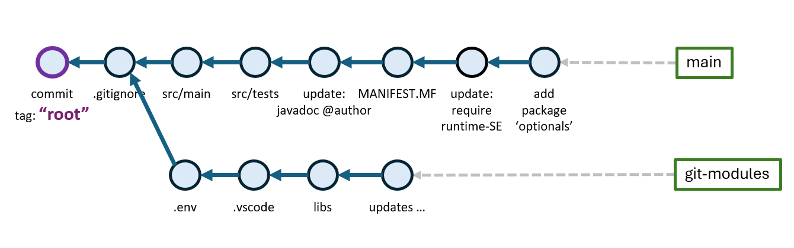

All code parts have been committed to the *main* branch. Branch *git-modules*
is used to maintain content of imported git-modules:
`.env`, `.vscode` and `libs`.


&nbsp;

---

The assignment will perform the following steps:

1. [Refactor new Branch: *"b1-optionals"*](#1-refactor-new-branch-b1-optionals)

1. [Setup Branch: *"b2-numbers"*](#2-setup-branch-b2-numbers)

1. [Implement *sum()*-Methods in *"NumbersImpl.java"*](#3-implement-sum---methods-in-numbersimpljava)

1. [Implement *find()*-Methods](#4-implement-find---methods)

1. [Implement the *findSums()*-Method](#5-implement-the-findsums---method)

1. [Implement the *findAllSums()*-Method](#6-implement-the-findallsums---method)

1. [*Code-Coverage* Analysis](#7-code-coverage-analysis)

1. [Final Evaluation (Abnahme)](#8-final-evaluation-abnahme)


<!-- - - - - - - - - - - - - - - - - - - - - - - - - - - - - - - - - - - - -->

&nbsp;

## 1. Refactor new Branch: *"b1-optionals"*

First, the *"optionals"* commit that has been been committed to the *main*
branch will be refactored to a new branch named: *"b1-optionals"*.

The figure shows the new branch *"b1-optionals"* branched off the *main*
branch at the commit tagged with *"base"* (one commit before the last commit).
We will tag the commit as *"base"* (branch point) for branch *"b1-optionals"*
and also for later branches *"b2-numbers"* and *"b3-streams":*

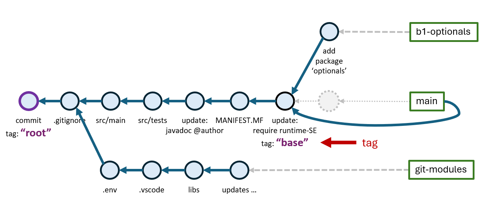


Tag the commit prior to the last commit as *"base":*

```sh
# tag the commit before the last commit: HEAD~1 (read HEAD minus 1) as 'base'
git tag base HEAD~1

git log --oneline
```
```
5bedaa3 (HEAD -> main) add package 'optionals'      <-- branch 'main' is one commit ahead
909ae20 (tag: base) module-info.java require module 'runtime-SE'        <-- 'base' commit
7e2d990 add src/resources/META-INF/MANIFEST.MF, jar packaging
5dd1890 update application/package-info.java, javadoc @author
bc107f2 add unit tests src/tests
67d598c add src/main
64a54c1 add .gitignore
265ca9b (tag: root) root commit (empty)
```

Next, a new branch *"b1-optionals"* is created off the *"base"* commit. Command
`git switch -c` creates a new branch (`-c`: *create*) and switches to it. The
third argument `base` specifies the commit the new branch is branched-off.
It can be a *tag*, a valid *commit id* or a relative reference auch as *HEAD~1:*

```sh
# create new branch 'b1-optionals' at commit 'base' and switch to it
git switch -c b1-optionals base

# show current branches
git branch
```
```
  git-modules
  main
* b1-optionals      <-- new active branch (*)
```

Next, *"optionals"* content previously committed to the *main* branch must
be relocated to the new branch. This can be done by using *git checkout:*

```sh
# obtain content from the 'main' branch (mind the dot '.' at the end)
git checkout main -- .

# show content obtained from the 'main' branch
git status
```
```
On branch b1-optionals              <-- new branch 'b1-optionals'
Changes to be committed:
  (use "git restore --staged <file>..." to unstage)
        modified:   src/main/module-info.java                   <-- modification
        new file:   src/main/optionals/OptionalsRunner.java     <-- new file
```

Checked-out content is already staged (shows in green) and can be committed
to the new branch *b1-optionals:*

```sh
# commit content to the 'b1-optionals' branch
git commit -m "add package 'optionals'"

# show the git-log of the current branch 'b1-optionals'
git log --oneline
```

The *git log* shows the commit on the new branch *b1-optionals:*

```
48f8ddb (HEAD -> b1-optionals) add package 'optionals'      <-- new commit on branch 'b1-optionals'
909ae20 (tag: base) module-info.java require module 'runtime-SE'  <-- 'base' commit
...
```

Branch *main* still points at the commit previously made for *"optionals"* content
(mind the different *commit id's*):

```sh
# show the git-log of branch 'main'
git log --oneline
```
```
ac7ed94 (HEAD -> main) add package 'optionals'              <-- previous commit on branch 'main'
909ae20 (tag: base, main) module-info.java require module 'runtime-SE'  <-- 'base' commit
```

The prior *optionals* commit on the *main* branch was not automatically removed
by the creation of the new commit. The *main* branch still points to it.

To resolve, the *main* branch pointer will be redirected to point to the *base*
commit:

```sh
# update branch pointer 'main' to point to 'base' commit
git branch -f main base

# show the git-log of the current branch 'b1-optionals'
git log --oneline
```

The *main* branch now points at the base commit:

```
48f8ddb (HEAD -> b1-optionals) add package 'optionals'
909ae20 (tag: base, main) module-info.java require module 'runtime-SE'
...
```

The unchained commit is no longer referenced and can be garbage-collected:

```sh
# collect unchained commits that are no longer referenced
git gc

# show the full git log of the project
git log --oneline --graph --all
```

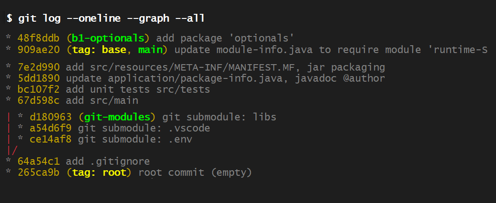


The *main* branch points at *base*. Branch *b1-optionals* is one commit ahead.
Other branches are unchanged.

Test the new branches:

```sh
# switch to branch 'main'
git switch main

# show 'src' content
find src
```

No *"optionals"* content is shown on *main* branch:

```
src
src/main
src/main/application
src/main/application/Application.java
src/main/application/package-info.java
src/main/module-info.java
src/resources
src/resources/application.properties
src/resources/META-INF
src/resources/META-INF/MANIFEST.MF
src/tests
src/tests/application
src/tests/application/Application_0_always_pass_Tests.java
```

*"Clean project build"* must work and perform code in *Application.java*
mirroring command line arguments:

```sh
# clean project build on branch 'main':
mk clean compile run  this is the main-branch
```
```
Hello, 'SE-1 Play' (version 1.0.0)
 - arg: this
 - arg: is
 - arg: the
 - arg: main-branch
```

Switch to the new branch *b1-optionals* and repeat:

```sh
# switch to branch 'b1-optionals'
git switch b1-optionals

# show 'src' content
find src
```

Now, *"optionals"* content showns on the *b1-optionals* branch:

```
src/main
src/main/application
src/main/application/Application.java
src/main/application/package-info.java
src/main/module-info.java
src/main/optionals                          <-- 'optionals' content
src/main/optionals/OptionalsRunner.java     <-- 'optionals' content
...
```

*"Clean project build"* must work and run the code in *OptionalsRunner.java*
performing the *article-price* examples:

```sh
# clean project build on branch 'main':
mk clean compile run  Kanne Becher Messer
```
```
Der Preis für 'Kanne' ist: 1999 €-Cent
Der Preis für 'Becher' ist: 749 €-Cent
Der Artikel 'Messer' konnte nicht gefunden werden
```


<!-- - - - - - - - - - - - - - - - - - - - - - - - - - - - - - - - - - - - -->

&nbsp;

## 2. Setup Branch: *"b2-numbers"*

Create a new branch: *"b2-numbers"* off the *base* commit that will be used
for the *"numbers"* examples.

Think about commands or ask an AI such that a new branch *"b2-numbers"* is
created as shown in the figure:

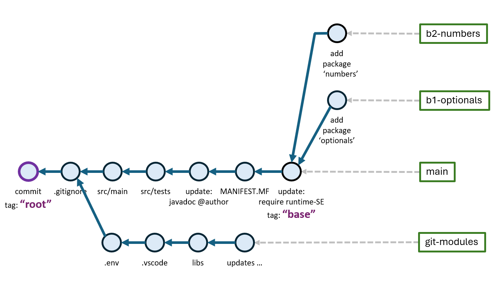

Make sure, no *"optionals"* content is on the new *"b2-numbers"* branch:

```sh
git branch          # shows 'numbers' as current branch

find src            # must not show 'optionals' content

mk clean compile run  this is main
```
```
Hello, 'SE-1 Play' (version 1.0.0)
 - arg: this
 - arg: is
 - arg: main
```

Fetch content from a remote *"se1-play"* repository:

```sh
# set the remote repository URL under the name: 'se1-repo'
git remote add se1-repo https://github.com/sgra64/se1-play.git

git remote -v                       # show name and URL of the new remote repository

# fetch branch 'b2-numbers' from the remote repository
git fetch se1-repo b2-numbers
```
<!-- 
```
remote: Enumerating objects: 25, done.
remote: Counting objects: 100% (22/22), done.
remote: Compressing objects: 100% (12/12), done.
remote: Total 25 (delta 7), reused 22 (delta 7), pack-reused 3 (from 1)
Unpacking objects: 100% (25/25), 17.24 KiB | 103.00 KiB/s, done.
From https://github.com/sgra64/se1-play
 * branch            b2-numbers -> FETCH_HEAD
 * [new branch]      b2-numbers -> se1-repo/b2-numbers
```
-->


Show the fetched remote branch:

```sh
# show fetched remote branch
git branch -avv
```

Output shows the new fetched remote branch: *se1-repo/b2-numbers* (in red):

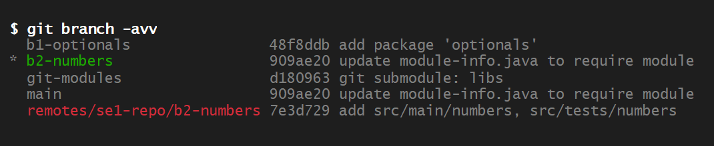

We can now include content from the fetched remote branch into the local
branch *b2-numbers*:

```sh
# checkout files from the remote branch 'se1-repo/b2-numbers'
git checkout se1-repo/b2-numbers -- \
    src/main/numbers/Numbers.java \
    src/main/numbers/NumbersRunner.java

# show content in new package 'numbers' (no 'optionals' content should be shown)
find src

# show new content as staged
git status

# commit package 'numbers'
git commit -m "package 'numbers' with interface 'Numbers.java' and 'NumbersRunner.java'"
```


<!-- - - - - - - - - - - - - - - - - - - - - - - - - - - - - - - - - - - - -->

&nbsp;

## 3. Implement *sum()* - Methods in *"NumbersImpl.java"*

Package *numbers* implements:

- interface [*Numbers.java*](src/main/numbers/Numbers.java), the

- driver class [*NumbersRunner.java*](src/main/numbers/NumbersRunner.java)
    and an

- [*application.properties*](src/main/resources/application.properties-numbers)
    file.

Interface [*Numbers.java*](src/main/numbers/Numbers.java) defines calculation
methods over integer numbers given as `int[]` arrays:

```java
package numbers;

import java.util.List;
import java.util.Set;

/**
 * Public interface with functions for the <i>"b1-numbers"</i> assignment.
 * 
 * @version <code style=color:green>{@value application.package_info#Version}</code>
 * @author <code style=color:blue>{@value application.package_info#Author}</code>
 */
public interface Numbers {

    /**
     * Calculate the sum of numbers[].
     * @param numbers input
     * @return sum of numbers[]
     */
    long sum(int[] numbers);

    /**
     * Calculate sum of positive even numbers[].
     * @param numbers input
     * @return sum of positive even numbers[]
     */
    long sumPositiveEvenNumbers(int[] numbers);

    /**
     * Calculate sum of numbers[] recursively without using loops
     * (for, while, do/while).
     * @param numbers input numbers
     * @param i start index, calculate sum from index i in numbers[]
     * @return sum of numbers[]
     */
    long sumRecursive(int[] numbers, int i);

    /**
     * Return index of first occurrence of x in numbers[] or return -1
     * if x was not found.
     * @param numbers input
     * @param x number to find
     * @return index of first occurrence of x in numbers[] or -1 if not found
     */
    int findFirst(int[] numbers, int x);

    /**
     * Return index of last occurrence of x in numbers[]
     * or return -1 if x was not found.
     * @param numbers input
     * @param x number to find
     * @return index of last occurrence of x in numbers[] or -1 if not found
     */
    int findLast(int[] numbers, int x);

    /**
     * Return list of all indices of number x in numbers[].
     * Return empty list, if x was not found.
     * @param numbers input
     * @param x number to find
     * @return list with all indices of x in numbers[]
     */
    List<Integer> findAll(int[] numbers, int x);

    /**
     * Immutable pair of integer values a and b used by {@code Set<Pair>
     * findSums(int[] numbers, int sum)}.
     * @param a first element of pair
     * @param b second element of pair
     */
    record Pair(int a, int b) {
        public String toString() { return String.format("(%d,%d)", a, b); }
    };

    /**
     * Return all pairs (a, b) in numbers[] matching a + b = sum.
     * Mirror copies (a, b), (b, a) are included once, either (a, b) or (b, a),
     * not both.
     * @param numbers input array of numbers
     * @param sum to match
     * @return all pairs (a, b) that add to sum
     */
    Set<Pair> findSums(int[] numbers, int sum);

    /**
     * Find all combinations of numbers in numbers[] that add to sum.
     * @param numbers input array of numbers
     * @param sum to match
     * @return all combinations of numbers that add to sum
     */
    Set<Set<Integer>> findAllSums(int[] numbers, int sum);
}
```

Create a *non-public* implementation class *"NumbersImpl.java"* that implements
the interface *"Numbers.java"*. Auto-complete methods such that the class compiles.

Edit file *module-info.java* to open package *numbers:*

```java
module se1_play {

    /*
     * Make package {@link application} accessible to other modules at compile
     * and runtime (use <i>open</i> for compile-time access only).
     */
    exports application;

    /* Open packages to JUnit test runner and the javadoc compiler. */
    opens application;
    opens numbers;          // <-- open package 'numbers'

    /*
     * External modules required by this module.
     */
    requires org.junit.jupiter.api;
    requires transitive runtimeSE;
}
```

Implement the first method: `long sum(int[] numbers)` that calculates the *sum*
of the numbers array passed as argument. Re-compile and run the program:

```sh
mk clean compile run

# run the program for method 'sum()' and numbers
mk run sum numbers=[1, 2, 3]
```

Output shows that the sum of the given numbers is 30:

```
Hello, 'SE-1 Play' (numbers)
 - sum([1, 2, 3]) -> 6
```

Run multiple calculations:

```sh
mk run \
    sum numbers=[-2, 4, 9, 4, -3, 4, 9, 5] \
    sum numbers=[100, 101, 102, 103] \
    sum numbers=[10000, -1]
```
```
Hello, 'SE-1 Play' (numbers)
 - sum([-2, 4, 9, 4, -3, 4, 9, 5]) -> 30
 - sum([100, 101, 102, 103]) -> 406
 - sum([10000, -1]) -> 9999
```

Add to your `application.properties` file the following numbers sets:
*"numb"*, *"numb_1"*, *"numb_2"* and *"numb_3":*

```properties
# - - - - - - - - - - - - - - - - - - - - - - - - - - - - - - - - - - -
# 'numbers' configuration
# - - - - - - - - - - - - - - - - - - - - - - - - - - - - - - - - - - -
# default arguments: numbers, sum, sum_positive_even_numbers,
#   sum_recursive, findFirst, findLast, findAll, findSums, findAllSums
numbers.args = sum numbers=[1, 2, 3]

# input data of numbers with negative numbers and duplicates
numbers.data.numb = -2, 4, 9, 4, -3, 4, 9, 5

# input data of numbers with no negative numbers and no duplicates
numbers.data.numb_1 = 8, 10, 7, 2, 14, 5, 4

# input data of a larger set of 24 numbers, no negatives, no duplicates
numbers.data.numb_2 = \
    371,  682,  446,  754,  205,  972,  600,  163,  541,  672, \
     27,  170,  226,    7,  190,  639,   87,  773,  651,  370, \
    125,  774,  903,  636
    #                    ,  225,  463,  286,  569,  384,    9

# input data of even larger set of 63 numbers, no negatives, no duplicates
numbers.data.numb_3 = \
     799, 2377,  936, 3498, 1342,  493, 1635, 4676, 1613, 3851, \
    1445, 4506, 3346,    7, 2141, 2064, 1491,  908,   78, 3325, \
    1756, 3691,   23, 1995, 1800,   15, 2784, 4305,   36, 2532, \
    4292, 4802, 2522, 4183, 3261, 2610,  803, 2656,  498, 1668, \
    2038, 2194,  440,  463, 4047, 4235, 3931,  756,  521, 4042, \
    3302,  485, 1002,  408, 4691, 3387, 3104, 3658, 2241, 4382, \
    1220, 3656,  500
```

Perform calculations on those data sets:

```sh
mk run \
    sum numbers=numb \
    sum numbers=numb_1 \
    sum numbers=numb_2 \
    sum numbers=numb_3
```
```
Hello, 'SE-1 Play' (numbers)
 - sum(numb) -> 30
 - sum(numb_1) -> 50
 - sum(numb_2) -> 10984
 - sum(numb_3) -> 141466
```

Checkout the *unit-test* from the remote branch fetched before:

```sh
# checkout test from the remote branch 'se1-repo/b2-numbers'
git checkout se1-repo/b2-numbers -- \
    src/tests/numbers/Numbers_1_sum_Tests.java \
    src/tests/numbers/TestData.java

# compile tests
mk compile-tests
```

Run tests in *VSCode*. Run only the first test-method: *test100_sum_regular()*.
If it completes with success, proceed to the next test-method. If a test
fails, find out what the reason was. Look at the test-method, which
*"expected value"* violated the calculated *"actual value"* and resolve
the problem in your code (not in the test).

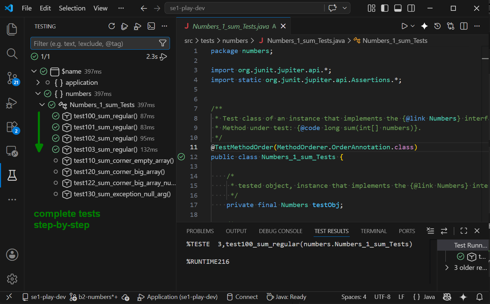


&nbsp;

When all tests pass in the *VSCode IDE*, run the test-class also in the
terminal:

```sh
# compile and run tests
mk compile-tests run-tests -c numbers.Numbers_1_sum_Tests
```

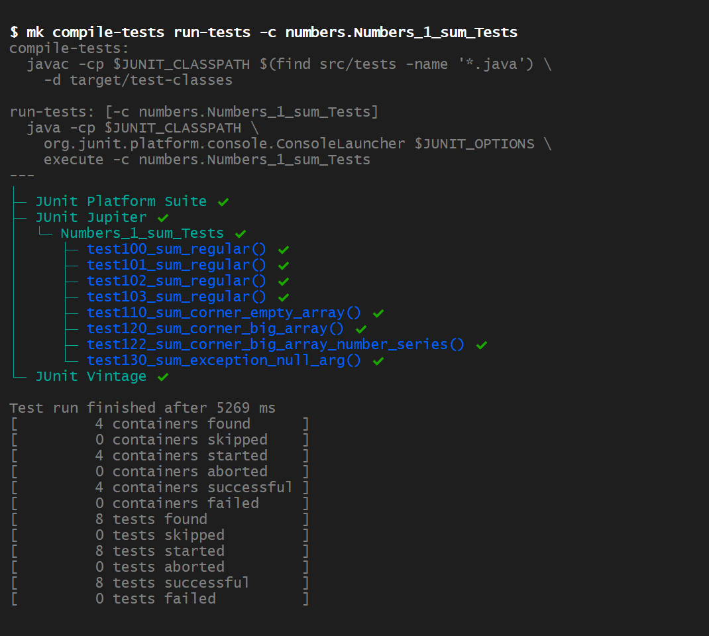


Next, implement the following two methods in the *Numbers.java* interface:

```java
/**
 * Calculate sum of positive even numbers[].
 * @param numbers input
 * @return sum of positive even numbers[]
 */
long sumPositiveEvenNumbers(int[] numbers);

/**
 * Calculate sum of numbers[] recursively without using loops
 * (for, while, do/while).
 * @param numbers input numbers
 * @param i start index, calculate sum from index i in numbers[]
 * @return sum of numbers[]
 */
long sumRecursive(int[] numbers, int i);
```


&nbsp;

Try out examples for *sumPositiveEvenNumbers:*

```sh
mk run \
    sumPositiveEvenNumbers numbers=numb \
    sumPositiveEvenNumbers numbers=numb_1 \
    sumPositiveEvenNumbers numbers=numb_2 \
    sumPositiveEvenNumbers numbers=numb_3
```

Output:

```
Hello, 'SE-1 Play' (numbers)
 - sumPositiveEvenNumbers(numb) -> 12
 - sumPositiveEvenNumbers(numb_1) -> 38
 - sumPositiveEvenNumbers(numb_2) -> 6492
 - sumPositiveEvenNumbers(numb_3) -> 80012
```


&nbsp;

Try out examples for *sumRecursive:*

```sh
mk run \
    sumRecursive numbers=numb \
    sumRecursive numbers=numb_1 \
    sumRecursive numbers=numb_2 \
    sumRecursive numbers=numb_3
```

Output:

```
Hello, 'SE-1 Play' (numbers)
 - sumRecursive(numb) -> 30
 - sumRecursive(numb_1) -> 50
 - sumRecursive(numb_2) -> 10984
 - sumRecursive(numb_3) -> 141466
```


&nbsp;

Fetch the corresponding tests:

```sh
# checkout corresponding test-classes from remote branch 'se1-repo/b2-numbers'
git checkout se1-repo/b2-numbers -- \
    src/tests/numbers/Numbers_2_sum_positive_even_Tests.java \
    src/tests/numbers/Numbers_3_sum_recursion_Tests.java
```

Validate tests in the *VSCode IDE* and resolve problems, if any. When all
tests pass, run test-classes in the terminal:


```sh
# compile and run tests
mk clean compile compile-tests run-tests \
    -c numbers.Numbers_1_sum_Tests \
    -c numbers.Numbers_2_sum_positive_even_Tests \
    -c numbers.Numbers_3_sum_recursion_Tests
```

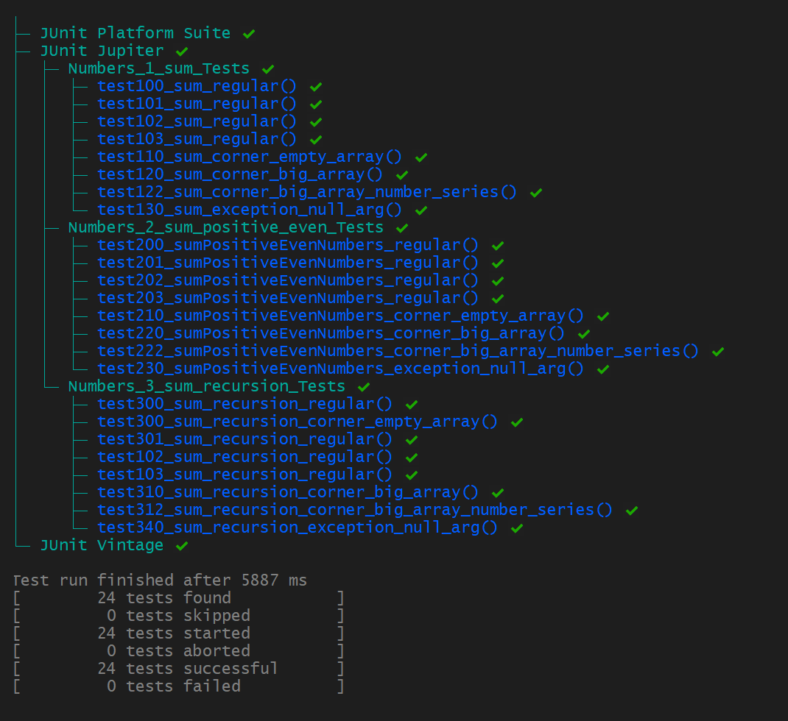


When all tests are passing:

1. Stage files of the current development for the next commit:

    ```
    On branch b2-numbers
    Changes to be committed:
    (use "git restore --staged <file>..." to unstage)
            modified:   src/main/module-info.java
            new file:   src/main/numbers/NumbersImpl.java
            modified:   src/resources/application.properties
            new file:   src/tests/numbers/Numbers_1_sum_Tests.java
            new file:   src/tests/numbers/Numbers_2_sum_positive_even_Tests.java
            new file:   src/tests/numbers/Numbers_3_sum_recursion_Tests.java
            new file:   src/tests/numbers/TestData.java
    ```

1. Commit with message: `"sum() methods complete"`.


&nbsp;

The commit is added to the *b2-numbers* branch:

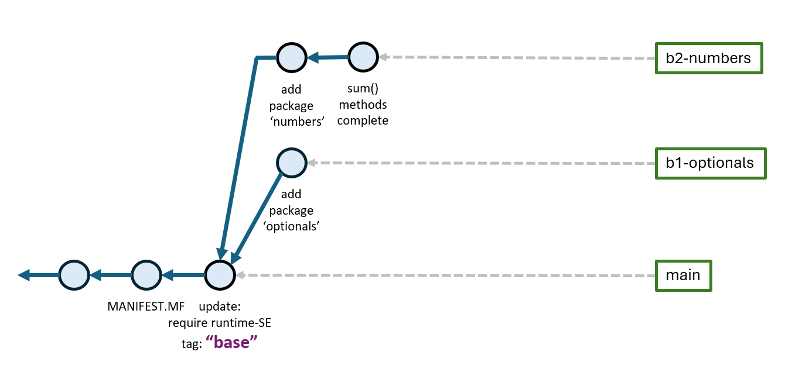


Validate the files of the last commit:

```sh
# show files of the last commit as difference between commits HEAD~1 and HEAD
git diff HEAD~1..HEAD --name-status
```
```
M       src/main/module-info.java                   <-- 'M' modified file
A       src/main/numbers/NumbersImpl.java           <-- 'A' new file (added)
M       src/resources/application.properties        <-- 'M' modified file
A       src/tests/numbers/Numbers_1_sum_Tests.java
A       src/tests/numbers/Numbers_2_sum_positive_even_Tests.java
A       src/tests/numbers/Numbers_3_sum_recursion_Tests.java
A       src/tests/numbers/TestData.java
```


<!-- - - - - - - - - - - - - - - - - - - - - - - - - - - - - - - - - - - - -->

&nbsp;

## 4. Implement *find()* - Methods

Next, implement methods that find a number *x* within a numbers array returning
its index or a list of matching indices.

```java
/**
 * Return index of first occurrence of x in numbers[] or return -1 if x was not found.
 * @param numbers input
 * @param x number to find
 * @return index of first occurrence of x in numbers[] or -1 if not found
 */
int findFirst(int[] numbers, int x);

/**
 * Return index of last occurrence of x in numbers[] or return -1 if x was not found.
 * @param numbers input
 * @param x number to find
 * @return index of last occurrence of x in numbers[] or -1 if not found
 */
int findLast(int[] numbers, int x);

/**
 * Return list of all indices of number x in numbers[]. Return empty list,
 * if x was not found.
 * @param numbers input
 * @param x number to find
 * @return list with all indices of x in numbers[]
 */
List<Integer> findAll(int[] numbers, int x);
```

Proceed implementing one method after another, run examples and checkout the
corresponding tests one after another (not all at once).


&nbsp;

Implement method *findFirst()* and test by the example:

```sh
mk compile run \
    findFirst numb x=4 \
    findFirst numb x=-3 \
    findFirst numb x=1
```
```
Hello, 'SE-1 Play' (numbers)
 - findFirst(numb, x=4) -> 1
 - findFirst(numb, x=-3) -> 4
 - findFirst(numb, x=1) -> -1
```

Checkout the the corresponding test-class *Numbers_4_find_first_Tests.java* from
the remote branch:

```sh
# checkout the corresponding test-class from remote branch 'se1-repo/b2-numbers'
git checkout se1-repo/b2-numbers -- \
    src/tests/numbers/Numbers_4_find_first_Tests.java
```

Run the tests for method *findFirst()* in the *VSCode IDE* first and then
(when passing) also in the terminal.

```sh
# compile and run 400'er tests
mk clean compile compile-tests run-tests \
    -c numbers.Numbers_4_find_first_Tests
```
```
╷
├─ JUnit Platform Suite ✔
├─ JUnit Jupiter ✔
│  └─ Numbers_4_find_first_Tests ✔
│     ├─ test400_find_first_regular() ✔
│     ├─ test401_find_first_regular_neg_element() ✔
│     ├─ test402_find_first_regular_duplicates() ✔
│     ├─ test403_find_first_regular_last() ✔
│     ├─ test404_find_first_regular_not_present() ✔
│     ├─ test410_find_first_regular_numb_1() ✔
│     ├─ test412_find_first_regular_numb_2() ✔
│     ├─ test414_find_first_regular_numb_3() ✔
│     ├─ test420_find_first_corner_empty_array() ✔
│     ├─ test430_find_first_corner_big_array() ✔
│     └─ test440_find_first_exception_null_arg() ✔
└─ JUnit Vintage ✔

Test run finished after 642 ms
[        11 tests successful      ]
[         0 tests failed          ]
```


&nbsp;

Implement method *findLast()* and run the examples:

```sh
mk compile run \
    findLast numb x=4 \
    findLast numb x=-3 \
    findLast numb x=1
```
```
Hello, 'SE-1 Play' (numbers)
 - findLast(numb, x=4) -> 5
 - findLast(numb, x=-3) -> 4
 - findLast(numb, x=1) -> -1
```

Checkout the corresponding test-class *Numbers_5_find_last_Tests.java* from
the remote branch:

```sh
# checkout the test-class
git checkout se1-repo/b2-numbers -- \
    src/tests/numbers/Numbers_5_find_last_Tests.java

# compile and run the 500'er tests
mk clean compile compile-tests run-tests \
    -c numbers.Numbers_5_find_last_Tests
```
```
╷
├─ JUnit Platform Suite ✔
├─ JUnit Jupiter ✔
│  └─ Numbers_5_find_last_Tests ✔
│     ├─ test500_find_last_regular() ✔
│     ├─ test501_find_last_regular_neg_element() ✔
│     ├─ test502_find_last_regular_duplicates() ✔
│     ├─ test503_find_last_regular_last() ✔
│     ├─ test504_find_last_regular_not_present() ✔
│     ├─ test510_find_last_regular_numb_1() ✔
│     ├─ test512_find_last_regular_numb_2() ✔
│     ├─ test514_find_last_regular_numb_3() ✔
│     ├─ test520_find_last_corner_empty_array() ✔
│     ├─ test530_find_last_corner_big_array() ✔
│     └─ test540_find_last_exception_null_arg() ✔
└─ JUnit Vintage ✔

Test run finished after 642 ms
[        11 tests successful      ]
[         0 tests failed          ]
```


&nbsp;

Implement method *findAll()* and run the examples:

```sh
mk compile run \
    findAll numb x=4 \
    findAll numb x=-3 \
    findAll numb x=1
```
```
Hello, 'SE-1 Play' (numbers)
 - findAll(numb, x=4) -> [1, 3, 5]
 - findAll(numb, x=-3) -> [4]
 - findAll(numb, x=1) -> []
```

Checkout the corresponding test-class *Numbers_6_find_all_Tests.java* from
the remote branch:

```sh
# checkout the test-class
git checkout se1-repo/b2-numbers -- \
    src/tests/numbers/Numbers_6_find_all_Tests.java \
    src/tests/numbers/Matchers.java


# compile and run the 600'er tests
mk clean compile compile-tests run-tests \
    -c numbers.Numbers_6_find_all_Tests
```
```
╷
├─ JUnit Platform Suite ✔
├─ JUnit Jupiter ✔
│  └─ Numbers_6_find_all_Tests ✔
│     ├─ test600_find_all_regular() ✔
│     ├─ test601_find_all_regular() ✔
│     ├─ test602_find_all_regular() ✔
│     ├─ test603_find_all_regular() ✔
│     └─ test640_find_all_exception_null_arg() ✔
└─ JUnit Vintage ✔

Test run finished after 271 ms
[         5 tests successful      ]
[         0 tests failed          ]
```

When all tests are passing:

- Stage files of the current development for the next commit:

    ```
    On branch b2-numbers
    Changes to be committed:
    (use "git restore --staged <file>..." to unstage)
            modified:   src/main/numbers/NumbersImpl.java
            new file:   src/tests/numbers/Matchers.java
            new file:   src/tests/numbers/Numbers_4_find_first_Tests.java
            new file:   src/tests/numbers/Numbers_5_find_last_Tests.java
            new file:   src/tests/numbers/Numbers_6_find_all_Tests.java
    ```

- Commit with message: `"find() methods complete"`.


&nbsp;

The commit is added to the *b2-numbers* branch:

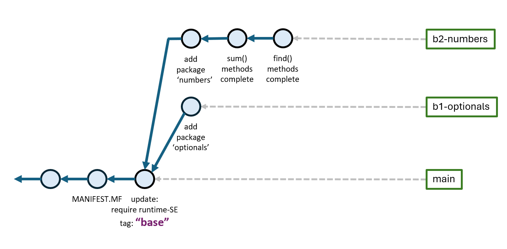


Validate the files of the last commit by comparing the last commit (*"HEAD"*)
with the commit before (*"HEAD~1"* - mind the `~` sign and read: head minus one):

```sh
# show files of the last commit as difference between commits HEAD~1 and HEAD
git diff HEAD~1..HEAD --name-status
```
```
M       src/main/numbers/NumbersImpl.java           <-- 'M' modified file
A       src/tests/numbers/Matchers.java             <-- 'A' new file (added)
A       src/tests/numbers/Numbers_4_find_first_Tests.java
A       src/tests/numbers/Numbers_5_find_last_Tests.java
A       src/tests/numbers/Numbers_6_find_all_Tests.java
```


<!-- - - - - - - - - - - - - - - - - - - - - - - - - - - - - - - - - - - - -->

&nbsp;

## 5. Implement the *findSums()* - Method

Next, implement method *findSums()* that finds all pairs of numbers that add
to a given target sum. The return set uses a `record Pair(int a, int b)`
to store a pair of values from the numbers set that add to the target sum.

```java
/**
 * Immutable pair of integer values a and b used by {@code Set<Pair>
 * findSums(int[] numbers, int sum)}.
 * @param a first element of pair
 * @param b second element of pair
 */
record Pair(int a, int b) {
    public String toString() { return String.format("(%d,%d)", a, b); }
};

/**
 * Return all pairs (a, b) in numbers[] matching a + b = sum.
 * Mirror copies (a, b), (b, a) are included once, either (a, b) or (b, a),
 * not both.
 * @param numbers input array of numbers
 * @param sum to match
 * @return all pairs (a, b) that add to sum
 */
Set<Pair> findSums(int[] numbers, int sum);

```

Implement method *findSums()* and run the examples.

Array *"numb_1"* has numbers: `[8, 10, 7, 2, 14, 5, 4]`. A given target
`sum=12` can be created from pairs: `(10,2)`, `(8,4)` and `(7,5)`.

```sh
mk run findSums numb_1 sum=12
```
```
Hello, 'SE-1 Play' (numbers)

 - findSums(numb_1, sum=12) -> [(10,2), (8,4), (7,5)], solutions: 3
```

Array *"numb_3"* has more numbers:

```properties
# input data of even larger set of 63 numbers, no negatives, no duplicates
numbers.data.numb_3 = \
     799, 2377,  936, 3498, 1342,  493, 1635, 4676, 1613, 3851, \
    1445, 4506, 3346,    7, 2141, 2064, 1491,  908,   78, 3325, \
    1756, 3691,   23, 1995, 1800,   15, 2784, 4305,   36, 2532, \
    4292, 4802, 2522, 4183, 3261, 2610,  803, 2656,  498, 1668, \
    2038, 2194,  440,  463, 4047, 4235, 3931,  756,  521, 4042, \
    3302,  485, 1002,  408, 4691, 3387, 3104, 3658, 2241, 4382, \
    1220, 3656,  500
```

Explore to find number-pairs from arrays *"numb_1"* and *"numb_3"* that
add to the given target sums:

```sh
mk run \
    findSums numb_1 sum=10 \
    findSums numb_1 sum=12 \
    findSums numb_1 sum=15 \
    findSums numb_3 sum=500 \
    findSums numb_3 sum=5000
```
```
Hello, 'SE-1 Play' (numbers)

 - findSums(numb_1, sum=10) -> [(2,8)], solutions: 1

 - findSums(numb_1, sum=12) -> [(5,7), (4,8), (2,10)], solutions: 3

 - findSums(numb_1, sum=15) -> [(7,8), (5,10)], solutions: 2

 - findSums(numb_3, sum=500) -> [(7,493), (485,15)], solutions: 2

 - findSums(numb_3, sum=5000) -> [(3387,1613), (3658,1342)], solutions: 2
```


&nbsp;

Checkout the corresponding test-classes *Numbers_7a_find_sums_Tests.java* and
*Numbers_7b_find_sums_duplicates_Tests.java* from the remote branch:

```sh
# checkout the corresponding test-class from remote branch 'se1-repo/b2-numbers'
git checkout se1-repo/b2-numbers -- \
    src/tests/numbers/Numbers_7a_find_sums_Tests.java \
    src/tests/numbers/Numbers_7b_find_sums_duplicates_Tests.java
```

Run the tests first in the *VSCode IDE* one test method after another and then
(when passing) also in the terminal.

```sh
# compile and run 700'er-a tests
mk clean compile compile-tests run-tests \
    -c numbers.Numbers_7a_find_sums_Tests
```
```
╷
├─ JUnit Platform Suite ✔
├─ JUnit Jupiter ✔
│  └─ Numbers_7a_find_sums_Tests ✔
│     ├─ test700_find_sums_regular() ✔
│     ├─ test701_find_sums_regular() ✔
│     ├─ test702_find_sums_regular() ✔
│     ├─ test703_find_sums_regular() ✔
│     ├─ test704_find_sums_regular() ✔
│     ├─ test705_find_sums_regular() ✔
│     ├─ test706_find_sums_regular() ✔
│     └─ test720_find_sums_exception_null_arg() ✔
└─ JUnit Vintage ✔

Test run finished after 431 ms
[         8 tests successful      ]
[         0 tests failed          ]
```

Run the extended test for dealing with duplicates and pair-order in
the result set:

```sh
# compile and run 700'er-b tests
mk clean compile compile-tests run-tests \
    -c numbers.Numbers_7b_find_sums_duplicates_Tests
```
```
╷
├─ JUnit Platform Suite ✔
├─ JUnit Jupiter ✔
│  └─ Numbers_7b_find_sums_duplicates_Tests ✔
│     ├─ test710_find_sums_duplicates() ✔
│     ├─ test711_find_sums_same_duplicates() ✔
│     ├─ test712_find_sums_mirror_duplicates() ✔
│     └─ test713_find_sums_regular_duplicates() ✔
└─ JUnit Vintage ✔

Test run finished after 253 ms
[         4 tests successful      ]
[         0 tests failed          ]
```

When all tests are passing:

- Stage files of the current development for the next commit:

    ```
    On branch b2-numbers
    Changes to be committed:
    (use "git restore --staged <file>..." to unstage)
            modified:   src/main/numbers/NumbersImpl.java
            new file:   src/tests/numbers/Numbers_7a_find_sums_Tests.java
            new file:   src/tests/numbers/Numbers_7b_find_sums_duplicates_Tests.java
    ```

- Commit with message: `"findSums() complete"`.


&nbsp;

The commit is added to the *b2-numbers* branch:

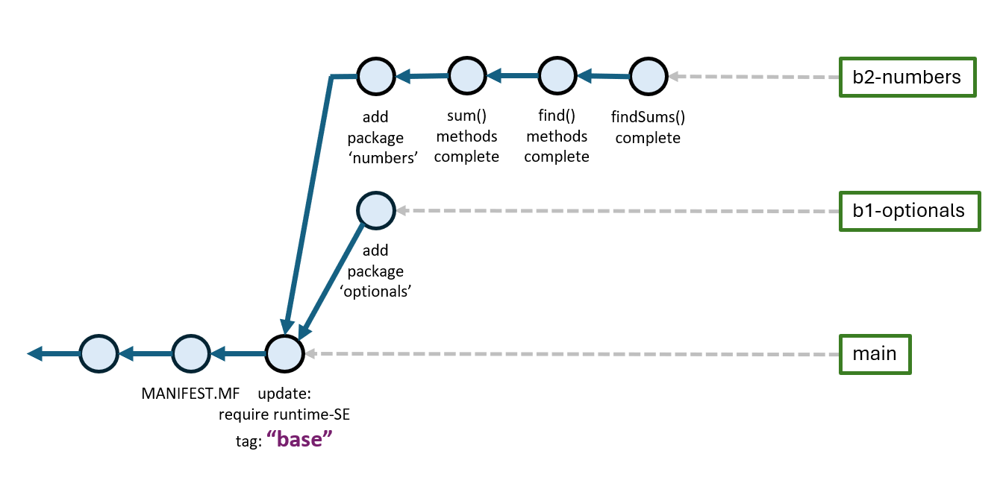


Validate the files of the last commit:

```sh
# show files of the last commit as difference between commits HEAD~1 and HEAD
git diff HEAD~1..HEAD --name-status
```
```
M       src/main/numbers/NumbersImpl.java           <-- 'M' modified file
A       src/tests/numbers/Numbers_7a_find_sums_Tests.java
A       src/tests/numbers/Numbers_7b_find_sums_duplicates_Tests.java
```


<!-- - - - - - - - - - - - - - - - - - - - - - - - - - - - - - - - - - - - -->

&nbsp;

## 6. Implement the *findAllSums()* - Method

Method *findAllSums()* generalizes method *findSums()* that it not only aims
at finding pairs that add to a target-sum, but find all subsets of a given
set of numbers.

```java
    /**
     * Find all combinations of numbers in numbers[] that add to sum.
     * @param numbers input array of numbers
     * @param sum to match
     * @return all combinations of numbers that add to sum
     */
    Set<Set<Integer>> findAllSums(int[] numbers, int sum);

```

Implement method *findAllSums()* and test by the example.

Array *"numb_1"* has numbers: `[8, 10, 7, 2, 14, 5, 4]`. The previous method
*findSums()* has shown that `sum=12` can be created from pairs: `(5,7)`, `(4,8)`
and `(2,10)`.

Method *findAllSums()* also finds that solution, but also other solutions that
do not consist of pairs only. An Example is `sum=14` that can be constructed
from sets: `[14]` (one number), `[4, 10]` (pair) and `[2, 4, 8]` (three numbers)
and `[2, 5, 7]` (three numbers).

Test examples:

```sh
mk run \
    findAllSums numb_1 sum=10 \
    findAllSums numb_1 sum=12 \
    findAllSums numb_1 sum=14 \
    findAllSums numb_1 sum=15 \
    findAllSums numb_1 sum=20
```
```
Hello, 'SE-1 Play' (numbers)

 - findAllSums(numb_1, sum=10) -> [[10], [2, 8]], solutions: 2

 - findAllSums(numb_1, sum=12) -> [[4, 8], [2, 10], [5, 7]], solutions: 3

 - findAllSums(numb_1, sum=14) -> [[14], [4, 10], [2, 4, 8], [2, 5, 7]], solutions: 4

 - findAllSums(numb_1, sum=15) -> [[7, 8], [5, 10], [2, 5, 8]], solutions: 3

 - findAllSums(numb_1, sum=20) -> [[2, 8, 10], [5, 7, 8], [2, 4, 14]], solutions: 3
```

Explore more combinations from the (larger) *numb_2* array:

```properties
# input data of a larger set of 24 numbers, no negatives, no duplicates
numbers.data.numb_2 = \
    371,  682,  446,  754,  205,  972,  600,  163,  541,  672, \
     27,  170,  226,    7,  190,  639,   87,  773,  651,  370, \
    125,  774,  903,  636
    #                    ,  225,  463,  286,  569,  384,    9
```

```sh
mk run \
    findAllSums numb_2 sum=1000 \
    findAllSums numb_2 sum=999
```
```
Hello, 'SE-1 Play' (numbers)

 - findAllSums(numb_2, sum=1000) -> [
    - [226, 774],
    - [754, 7, 87, 27, 125],
    - [7, 27, 636, 205, 125],
    - [7, 27, 651, 125, 190],
    - [7, 27, 205, 125, 446, 190]
   ], solutions: 5

 - findAllSums(numb_2, sum=999) -> [
    - [27, 972],
    - [226, 773],
    - [170, 190, 639],
    - [371, 87, 541],
    - [226, 27, 205, 541],
    - [163, 170, 541, 125],
    - [163, 170, 27, 639],
    - [163, 7, 190, 639],
    - [226, 371, 170, 27, 205],
    - [226, 371, 7, 205, 190],
    - [226, 371, 87, 125, 190],
    - [226, 371, 163, 7, 27, 205],
    - [226, 371, 163, 87, 27, 125]
   ], solutions: 13
```

Checkout the test-classes *Numbers_8a_find_all_sums_Tests.java* from the
remote branch:

```sh
# checkout the corresponding test-class from remote branch 'se1-repo/b2-numbers'
git checkout se1-repo/b2-numbers -- \
    src/tests/numbers/Numbers_8a_find_all_sums_Tests.java
```

Run the tests first in the *VSCode IDE* one test method after another and then
(when passing) also in the terminal.

```sh
# compile and run 800'er-a tests
mk clean compile compile-tests run-tests \
    -c numbers.Numbers_8a_find_all_sums_Tests
```
```
╷
├─ JUnit Platform Suite ✔
├─ JUnit Jupiter ✔
│  └─ Numbers_8a_find_all_sums_Tests ✔
│     ├─ test800_find_all_sums_regular() ✔
│     ├─ test801_find_all_sums_regular() ✔
│     ├─ test802_find_all_sums_regular() ✔
│     ├─ test802_find_all_sums_regular_no_match() ✔
│     ├─ test821_find_all_sums_regular_numb_2_sum999() ✔
│     └─ test830_find_all_sums_exception_null_arg() ✔
└─ JUnit Vintage ✔

Test run finished after 298 ms
[         6 tests successful      ]
[         0 tests failed          ]
```

Incrementally add more numbers to *numb_2* and seek solutions for target `sum=999`.
With more numbers available, the number of solutions increases.

A *"bruteforce"* algorithm will take increasing time from the *24th* number
and not come to an end if more numbers are added.

- add number *225* --> 19 solutions,

- add number *463* --> 19 solutions,

- add number *286* --> 19 solutions,

- add number *569* --> 21 solutions,

- add number *384* --> 24 solutions,

- add number *9* --> 44 solutions.

There are 44 solution for all numbers from *numb_2* included:

```
-> findAllSums(sum=999, numb_2) -> [
    - [226, 773],                   - [371, 27, 125, 286, 190],
    - [27, 972],                    - [225, 226, 371, 7, 170],
    - [225, 774],                   - [226, 7, 569, 170, 27],
    - [170, 190, 639],              - [225, 370, 9, 205, 190],
    - [371, 87, 541],               - [226, 163, 371, 7, 27, 205],
    - [225, 569, 205],              - [226, 163, 371, 87, 27, 125],
    - [903, 87, 9],                 - [226, 163, 9, 125, 286, 190],
    - [226, 9, 125, 639],           - [225, 7, 9, 170, 125, 463],
    - [163, 9, 541, 286],           - [384, 7, 170, 27, 125, 286],
    - [163, 170, 27, 639],          - [384, 226, 163, 9, 27, 190],
    - [225, 226, 7, 541],           - [225, 7, 9, 27, 541, 190],
    - [163, 170, 125, 541],         - [225, 87, 7, 27, 190, 463],
    - [163, 7, 190, 639],           - [384, 226, 87, 7, 9, 286],
    - [773, 9, 27, 190],            - [7, 9, 125, 205, 190, 463],
    - [226, 27, 541, 205],          - [9, 170, 27, 125, 205, 463],
    - [163, 87, 286, 463],          - [225, 87, 9, 27, 205, 446],
    - [384, 27, 125, 463],          - [384, 226, 87, 7, 170, 125],
    - [226, 371, 87, 125, 190],     - [225, 370, 163, 9, 27, 205],
    - [226, 371, 170, 27, 205],     - [225, 371, 7, 9, 170, 27, 190],
    - [226, 371, 7, 205, 190],      - [163, 7, 9, 27, 125, 205, 463],
    - [163, 371, 9, 170, 286],      - [370, 226, 7, 9, 170, 27, 190],
    - [225, 87, 9, 651, 27],        - [384, 87, 7, 9, 170, 27, 125, 190]
   ], solutions: 44
```


A *"bruteforce"* algorithm not end with 60 or more numbers such as in array
*"numb_3"*. In this case `2^60` possible combinations need to be generated
and evaluated , which is: `1,152,921,504,606,846,976` (1 billion billion).
Under the assumption that a 1 GHz Processor can process 1 billion operations
per second, exploring that solution space would require 1 billion seconds,
which is ca. *11,500 days* or *31 years*.

Hence, more sophisticated algorithms are needed that shortcut exploring the
solution space when a target sum has already been exceeded. No further
solutions are evaluated and entire regions of the solution space are cut off.

```properties
# input data of even larger set of 63 numbers, no negatives, no duplicates
numbers.data.numb_3 = \
     799, 2377,  936, 3498, 1342,  493, 1635, 4676, 1613, 3851, \
    1445, 4506, 3346,    7, 2141, 2064, 1491,  908,   78, 3325, \
    1756, 3691,   23, 1995, 1800,   15, 2784, 4305,   36, 2532, \
    4292, 4802, 2522, 4183, 3261, 2610,  803, 2656,  498, 1668, \
    2038, 2194,  440,  463, 4047, 4235, 3931,  756,  521, 4042, \
    3302,  485, 1002,  408, 4691, 3387, 3104, 3658, 2241, 4382, \
    1220, 3656,  500
```

This allows exploring larger number spaces such as *"numb_3"*:

```sh
mk run \
    findAllSums numb_3 sum=999 \
    findAllSums numb_3 sum=1000
```
```
 - findAllSums(numb_3, sum=999) -> [
    - [521, 15, 463],
    - [36, 500, 463],
    - [36, 7, 493, 463],
    - [498, 408, 78, 15],
    - [498, 23, 15, 463],
    - [23, 440, 521, 15],
    - [36, 500, 23, 440],
    - [36, 485, 15, 463],
    - [36, 7, 23, 440, 493],
    - [36, 485, 23, 440, 15]
   ], solutions: 10

 - findAllSums(numb_3, sum=1000) -> [
    - [500, 7, 493],
    - [500, 485, 15],
    - [485, 7, 493, 15],
    - [36, 408, 78, 15, 463],
    - [36, 23, 440, 408, 78, 15]
   ], solutions: 5
```


&nbsp;

Checkout the test-classes *Numbers_8a_find_all_sums_Tests.java* from the
remote branch:

```sh
# checkout the corresponding test-class from remote branch 'se1-repo/b2-numbers'
git checkout se1-repo/b2-numbers -- \
    src/tests/numbers/Numbers_8b_find_all_sums_XL_Tests.java
```

Run the tests first in the *VSCode IDE* one test method after another and then
(when passing) also in the terminal.

```sh
# compile and run 800'er-a tests
mk clean compile compile-tests run-tests \
    -c numbers.Numbers_8a_find_all_sums_Tests \
    -c numbers.Numbers_8b_find_all_sums_XL_Tests
```
```
╷
├─ JUnit Platform Suite ✔
├─ JUnit Jupiter ✔
│  │ 
│  ├─ Numbers_8a_find_all_sums_Tests ✔
│  │  ├─ test800_find_all_sums_regular() ✔
│  │  ├─ test801_find_all_sums_regular() ✔
│  │  ├─ test802_find_all_sums_regular() ✔
│  │  ├─ test802_find_all_sums_regular_no_match() ✔
│  │  ├─ test821_find_all_sums_regular_numb_2_sum999() ✔
│  │  └─ test830_find_all_sums_exception_null_arg() ✔
│  │ 
│  └─ Numbers_8b_find_all_sums_XL_Tests ✔
│     ├─ test824_find_all_sums_XL_24_numbers() ✔
│     ├─ test825_find_all_sums_XL_25_numbers() ✔
│     ├─ test826_find_all_sums_XL_26_numbers() ✔
│     ├─ test827_find_all_sums_XL_27_numbers() ✔
│     ├─ test828_find_all_sums_XL_28_numbers() ✔
│     ├─ test829_find_all_sums_XL_29_numbers() ✔
│     ├─ test830_find_all_sums_XL_30_numbers() ✔
│     ├─ test840_find_all_sums_XL_numb_3_999() ✔
│     └─ test841_find_all_sums_XL_numb_3_1000() ✔
└─ JUnit Vintage ✔

Test run finished after 450 ms
[        15 tests successful      ]
[         0 tests failed          ]
```


&nbsp;

When all tests are passing:

- Stage files of the current development for the next commit:

    ```
    On branch b2-numbers
    Changes to be committed:
    (use "git restore --staged <file>..." to unstage)
            modified:   src/main/numbers/NumbersImpl.java
            new file:   src/tests/numbers/Numbers_8a_find_all_sums_Tests.java
            new file:   src/tests/numbers/Numbers_8b_find_all_sums_XL_Tests.java
    ```
    <!--    new file:   src/main/numbers/NumbersImpl_FindAllSums.java -->

- Commit with message: `"findAllSums() complete"`.


&nbsp;

The figure shows the final branch *b2-numbers* has five commits:

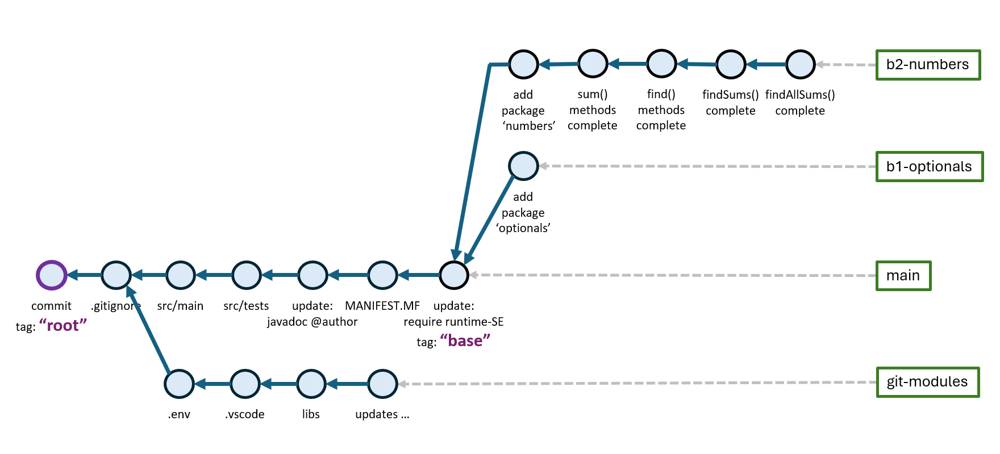


Validate the files of the last commit:

```sh
# show files of the last commit as difference between commits HEAD~1 and HEAD
git diff HEAD~1..HEAD --name-status
```
```
M       src/main/numbers/NumbersImpl.java           <-- 'M' modified file
A       src/tests/numbers/Numbers_8a_find_all_sums_Tests.java
A       src/tests/numbers/Numbers_8b_find_all_sums_XL_Tests.java
```
<!-- A       src/main/numbers/NumbersImpl_FindAllSums.java -->


<!-- - - - - - - - - - - - - - - - - - - - - - - - - - - - - - - - - - - - -->

&nbsp;

## 7. *Code-Coverage* Analysis

*Code Coverage* is a software quality metric that defines the ratio between:

- code statements that were *executed during tests* and

- *all* code statements.

For example, if a file has 700 lines and 620 lines were executed during a test
run, the code coverage ratio is: *620 / 700 = 88.6 %*.

In order to determine code coverage, the executed statements during a test run
must be recorded. From this recording, a *test coverage report* is created.

[*JaCoCo*](https://www.eclemma.org/jacoco) is a popular code coverage tool
that is included in the project under: `libs/jacoco`:

```
total 872
drwxr-xr-x 1 svgr2 Kein      0 May 17 21:11 .
drwxr-xr-x 1 svgr2 Kein      0 May 17 21:11 ..
-rw-r--r-- 1 svgr2 Kein 300661 May 17 21:11 jacocoagent.jar
-rw-r--r-- 1 svgr2 Kein 583967 May 17 21:11 jacococli.jar
```

Library `jacocoagent.jar` is used to record execution of statements during test
runs. Library `jacococli.jar` is used to create test-reports with coverage
metrics from the recordings.

Creating a code coverage report requires two steps:

1. Execute tests with the *jacocoagent.jar*. All tests should pass for code
    coverage analysis:

    ```sh
    # compile code and tests
    mk compile compile-tests

    # run specific test with recording execution in the tested code
    mk coverage -c numbers.Numbers_1_sum_Tests

    # run all tests with recording execution in the tested code
    mk coverage
    ```

    The recording is stored in file: `target/coverage/jacoco.exec`.

1. Create test-report for the package `numbers` from the recording:

    ```sh
    # create coverage report for the specific class 'numbers/NumbersImpl.class'
    # from the recording or for the entire package 'numbers'
    mk coverage-report numbers/NumbersImpl.class
    mk coverage-report numbers
    ```

    The report is stored as *HTML* under: `target/coverage-report/index.html`

    The test-report is also created as file: `target/jacoco.xml` for the
    [*Coverage Gutters*](https://marketplace.visualstudio.com/items?itemName=ryanluker.vscode-coverage-gutters)
    *VSCode-Plugin* that displays coverage also in the *VSCode* editor.

To review the code coverage report, the *index.html* file can be opened in a
web-browser.

Current tests cover the file *NumbersImpl.java*. Therefore, report-generation
should be limited to this class for analysis (otherwise, other un-tested code
distorts the analysis).

The figures show the created coverage report for class *NumbersImpl.java* in
package *numbers*. The coverage is shown as *97%* :


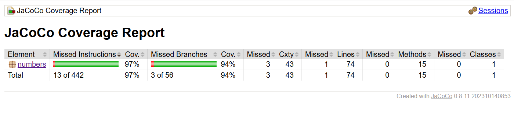

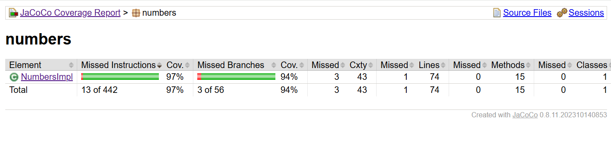


&nbsp;

Clicking into class *NumbersImpl.java* reveals the coverage breakdown to methods.
Most methods are at *100%*, except for *findAll()* (*68%*) and *findSums()* (*98%*).

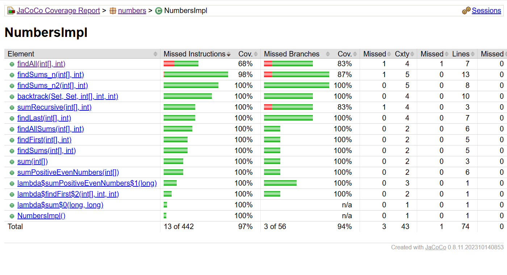


&nbsp;

*"Green"* lines indicate that they were executed at least once during the test run.
*"Red"* lines were not executed during the test run.
*"Yellow"* lines were *"partially"* executed.

Method *findAll()* shows one yellow and one red line. The test for `numbers==null`
and throwing an *IllegalArgumentException* as a consequence was never executed
during tests.

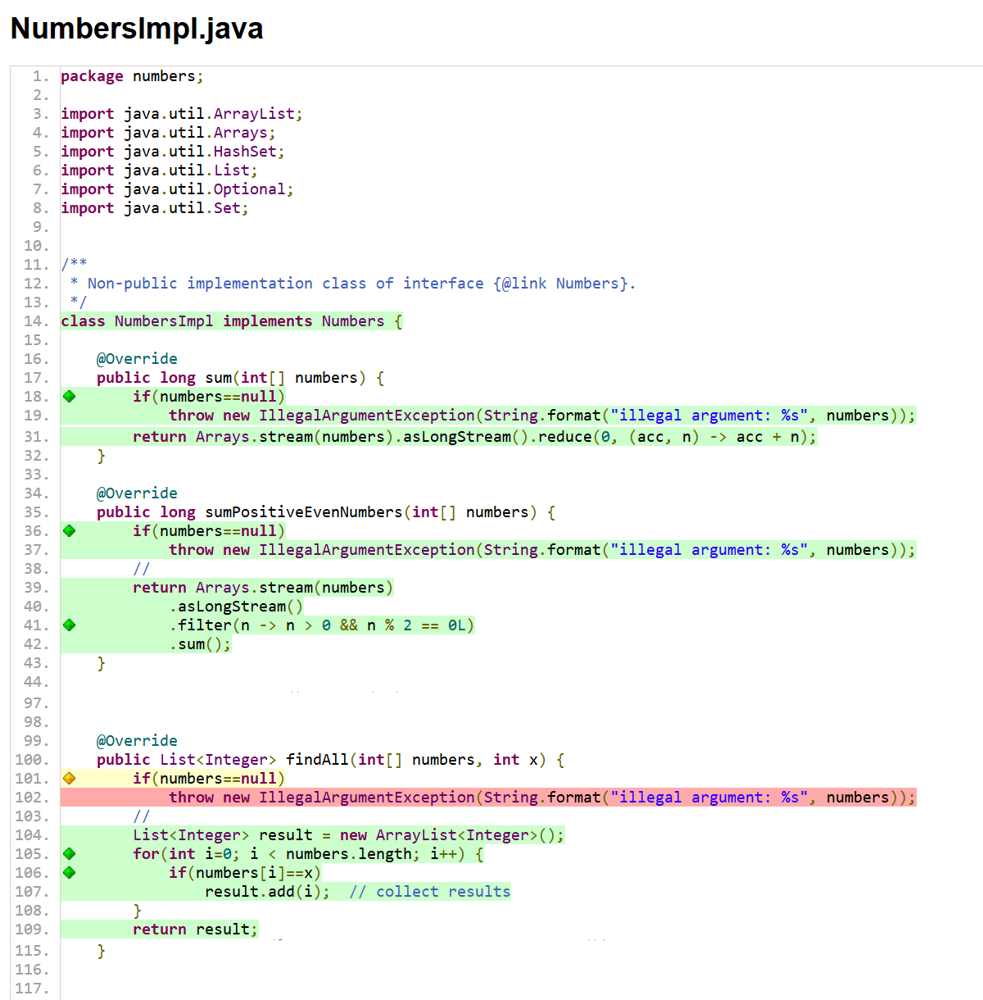


&nbsp;

In order to *"cover this case"*, another test *641* can be added to
`Numbers_6_find_all_Tests.java`:

```java
@Test @Order(641)
void test641_find_all_exception_null_arg() {
    IllegalArgumentException ex =
        assertThrows(IllegalArgumentException.class,
            () -> testObj.findAll(null, 0));
    // 
    assertEquals("illegal argument: null", ex.getMessage());
}
```

After the case has been covered, method *findAll()* also shows full coverage:

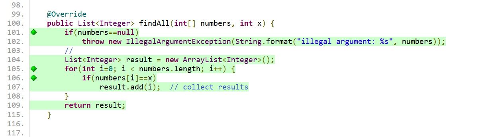


<!-- - - - - - - - - - - - - - - - - - - - - - - - - - - - - - - - - - - - -->

&nbsp;

## 8. Final Evaluation (Abnahme)

For the final evaluation, please prepare two terminals showing the results of
the following commands.

```sh
# show 'clean project build' is working
mk clean compile javadoc package

# show that the .jar produces correct results
java -jar target/application-1.0.0-SNAPSHOT.jar \
    sum numbers=[-2, 4, 9, 4, -3, 4, 9, 5] \
    sum numbers=numb \
    sum_positive_even_numbers numbers=numb_1 \
    sum_recursive numbers=numb_2 \
    sum numbers=numb_3 \
    \
    findFirst numb x=4 \
    findFirst numb x=-3 \
    findFirst numb x=1 \
    \
    findLast numb x=4 \
    findLast numb x=-3 \
    findLast numb x=1 \
    \
    findAll numb x=4 \
    findAll numb x=-3 \
    findAll numb x=1 \
    \
    findSums numb_1 sum=12 \
    findSums numb_1 sum=10 \
    findSums numb_1 sum=12 \
    findSums numb_1 sum=15 \
    findSums numb_3 sum=500 \
    findSums numb_3 sum=5000
```

Output:

```
Hello, 'SE-1 Play' (numbers)

 - sum([-2, 4, 9, 4, -3, 4, 9, 5]) -> 30
 - sum(numb) -> 30
 - sum_positive_even_numbers(numb_1) -> 38
 - sum_recursive(numb_2) -> 10984
 - sum(numb_3) -> 141466
 
 - findFirst(numb, x=4) -> 1
 - findFirst(numb, x=-3) -> 4
 - findFirst(numb, x=1) -> -1
 
 - findLast(numb, x=4) -> 5
 - findLast(numb, x=-3) -> 4
 - findLast(numb, x=1) -> -1
 
 - findAll(numb, x=4) -> [1, 3, 5]
 - findAll(numb, x=-3) -> [4]
 - findAll(numb, x=1) -> []

 - findSums(numb_1, sum=12) -> [(5,7), (4,8), (2,10)], solutions: 3
 - findSums(numb_1, sum=10) -> [(2,8)], solutions: 1
 - findSums(numb_1, sum=12) -> [(5,7), (4,8), (2,10)], solutions: 3
 - findSums(numb_1, sum=15) -> [(7,8), (5,10)], solutions: 2
 - findSums(numb_3, sum=500) -> [(7,493), (485,15)], solutions: 2
 - findSums(numb_3, sum=5000) -> [(3387,1613), (3658,1342)], solutions: 2
```

```sh
# show correct results for 'findAllSums'
java -jar target/application-1.0.0-SNAPSHOT.jar \
    \
    findAllSums numb_2 sum=1000 \
    findAllSums numb_2 sum=999 \
    findAllSums numb_3 sum=999 \
    findAllSums numb_3 sum=1000
```

Output:

<table>
<td valign="top">
<pre>
 - findAllSums(numb_2, sum=1000) -> [
    - [226, 774],
    - [754, 7, 87, 27, 125],
    - [7, 27, 636, 205, 125],
    - [7, 27, 651, 125, 190],
    - [7, 27, 205, 125, 446, 190]
   ], solutions: 5
</pre><pre>
 - findAllSums(numb_2, sum=999) -> [
    - [27, 972],
    - [226, 773],
    - [371, 87, 541],
    - [170, 190, 639],
    - [226, 27, 205, 541],
    - [163, 170, 541, 125],
    - [163, 170, 27, 639],
    - [163, 7, 190, 639],
    - [226, 371, 170, 27, 205],
    - [226, 371, 7, 205, 190],
    - [226, 371, 87, 125, 190],
    - [226, 371, 163, 7, 27, 205],
    - [226, 371, 163, 87, 27, 125]
   ], solutions: 13
</pre>
</td>
<td valign="top">
<pre>
 - findAllSums(numb_3, sum=999) -> [
    - [521, 15, 463],
    - [36, 500, 463],
    - [36, 7, 493, 463],
    - [498, 408, 78, 15],
    - [498, 23, 15, 463],
    - [23, 440, 521, 15],
    - [36, 500, 23, 440],
    - [36, 485, 15, 463],
    - [36, 7, 23, 440, 493],
    - [36, 485, 23, 440, 15]
   ], solutions: 10
</pre><pre>
 - findAllSums(numb_3, sum=1000) -> [
    - [500, 7, 493],
    - [500, 485, 15],
    - [485, 7, 493, 15],
    - [36, 408, 78, 15, 463],
    - [36, 23, 440, 408, 78, 15]
   ], solutions: 5
</pre>
</td>
</table>

In the second terminal, prepare that all tests are passing and commits are
correctly recorded on branch *b2-numbers:*

```sh
# run tests
mk clean compile compile-tests run-tests
```
```
Test run finished after 6636 ms
[        80 tests found           ]
[         0 tests skipped         ]
[        80 tests successful      ]     <-- 80 tests successful
[         0 tests failed          ]     <--  0 tests failed
```

The [*test-report*](markup/tests-9-numbers-final.png)
shows all tests are passing in the terminal.

```sh
# show 'src' with packages 'numbers' under 'src/main' and 'src/tests'
find src -name '*.java'
```
```
src/main/application/Application.java
src/main/application/package-info.java
src/main/module-info.java
src/main/numbers/Numbers.java
src/main/numbers/NumbersImpl.java
src/main/numbers/NumbersRunner.java

src/tests/application/Application_0_always_pass_Tests.java
src/tests/numbers/Matchers.java
src/tests/numbers/Numbers_1_sum_Tests.java
src/tests/numbers/Numbers_2_sum_positive_even_Tests.java
src/tests/numbers/Numbers_3_sum_recursion_Tests.java
src/tests/numbers/Numbers_4_find_first_Tests.java
src/tests/numbers/Numbers_5_find_last_Tests.java
src/tests/numbers/Numbers_6_find_all_Tests.java
src/tests/numbers/Numbers_7a_find_sums_Tests.java
src/tests/numbers/Numbers_7b_find_sums_duplicates_Tests.java
src/tests/numbers/Numbers_8a_find_all_sums_Tests.java
src/tests/numbers/Numbers_8b_find_all_sums_XL_Tests.java
src/tests/numbers/TestData.java
```
<!-- src/main/numbers/NumbersImpl_FindAllSums.java -->


Show lthe ocal *git* repository:

```sh
# show the commit log for branch 'b2-numbers'
git switch b2-numbers
git log --oneline

# show all branches, including the remote branch 'se1-repo/b2-numbers'
git branch -avv
```

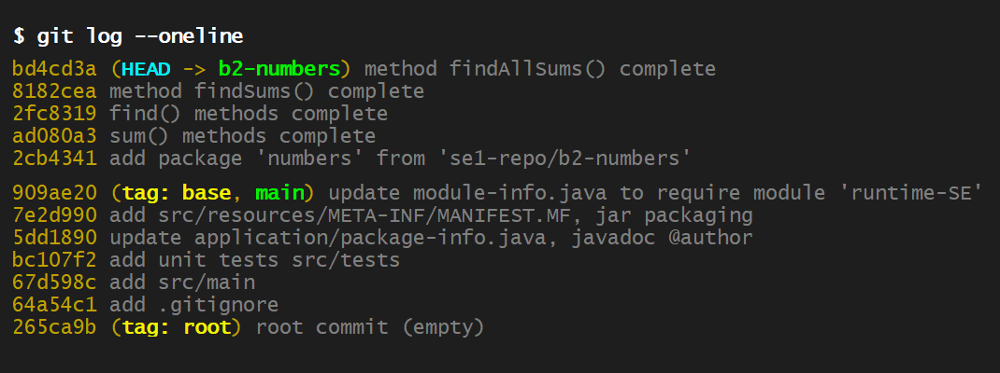


Open *VSCode* and show tests are also passing in the IDE:
<!-- 

 -->

